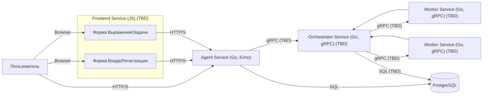

<div align="center">
   
  <h1>Распределённый Калькулятор Выражений Оркестратор-Воркер</h1>

  <p>Сервис для вычисления арифметических выражений с использованием распределенной архитектуры Оркестратор-Воркер, многопользовательским режимом, аутентификацией (JWT) и хранением данных в PostgreSQL.</p>

<p>
  <a href="https://github.com/Qu1nel/YaLyceum-GoProject-Final/graphs/contributors">
    
  </a>
  <a href="https://github.com/Qu1nel/YaLyceum-GoProject-Final/commits/main">
    
  </a>
  <a href="https://github.com/Qu1nel/YaLyceum-GoProject-Final/network/members">
    
  </a>
  <a href="https://github.com/Qu1nel/YaLyceum-GoProject-Final/stargazers">
    
  </a>
  <a href="https://github.com/Qu1nel/YaLyceum-GoProject-Final/issues/">
    
  </a>
</p>
<p>
  <a href="https://go.dev/doc/install" >
    
  <a>
  <a href="https://github.com/Qu1nel/YaLyceum-GoProject-Final/blob/main/LICENSE">
    
  </a>
</p>
<h4>
  <!-- Демо пока его нет => -->
  <a href="#-api-документация-и-примеры">Документация API</a>
  <span> · </span>
  <a href="https://github.com/Qu1nel/YaLyceum-GoProject-Final/issues/">Сообщить о баге</a>
  <span> · </span>
  <a href="https://github.com/Qu1nel/YaLyceum-GoProject-Final/issues/">Предложить функционал</a>
</h4>
</div>

<br />

# Содержание

- [🚧 План разработки (TODO)](#-план-разработки-todo)
- [О проекте](#о-проекте)
  - [Основные возможности](#основные-возможности)
  - [Поддерживаемые операции](#поддерживаемые-операции)
- [Архитектура](#архитектура)
- [Технологический стек](#технологический-стек)
- [Предварительные требования](#предварительные-требования)
- [🚀 Быстрый запуск (Локально)](#-быстрый-запуск-локально)
- [⚙️ Конфигурация](#️-конфигурация)
- [📝 API Документация и Примеры](#-api-документация-и-примеры)
  - [Аутентификация](#аутентификация)
  - [Вычисления (TBD)](#вычисления-tbd)
  - [Задачи (TBD)](#задачи-tbd)
- [Начало работы с API](#начало-работы-с-api)
  - [Использование `curl`](#использование-curl)
  - [Использование Веб-интерфейса (TBD)](#использование-веб-интерфейса-tbd)
  - [Использование Postman (TBD)](#использование-postman-tbd)
- [Структура Проекта](#структура-проекта)
- [✅ Запуск Тестов](#-запуск-тестов)
- [Остановка Приложения](#остановка-приложения)
- [Разработчики](#разработчики)
- [Связь](#связь)
- [Лицензия](#лицензия)

## 🚧 План разработки (TODO)

Этот раздел предназначен для отслеживания ключевых задач разработки:

*   **[ ] Аутентификация:**
    *   **[X]** Регистрация (`/register`) и Логин (`/login`) с хешированием паролей (bcrypt).
    *   **[ ]** Реализация генерации JWT токенов при логине.
    *   **[ ]** Реализация JWT Middleware для защиты эндпоинтов.
    *   **[ ]** Извлечение `UserID` из токена и передача в контексте.
*   **[ ] API Agent:**
    *   **[ ]** Реализация эндпоинта `POST /calculate` (прием выражения, запуск задачи).
    *   **[ ]** Реализация эндпоинта `GET /tasks` (получение списка задач пользователя).
    *   **[ ]** Реализация эндпоинта `GET /tasks/{id}` (получение деталей задачи).
    *   **[ ]** Интеграция Swagger/OpenAPI для авто-документации.
*   **[ ] gRPC:**
    *   **[X]** Определение `.proto` контракта Agent <-> Orchestrator.
    *   **[ ]** Реализация gRPC клиента в Agent для вызова Оркестратора.
    *   **[ ]** Реализация gRPC сервера в Оркестраторе.
    *   **[X]** Определение `.proto` контракта Orchestrator <-> Worker.
    *   **[ ]** Реализация gRPC клиента в Оркестраторе для вызова Воркеров.
    *   **[ ]** Реализация gRPC сервера в Воркере.
*   **[ ] Оркестратор:**
    *   **[X]** Базовая структура сервиса (main.go, Dockerfile).
    *   **[ ]** Получение задач от Агента по gRPC.
    *   **[ ]** Интеграция существующего парсера выражений.
    *   **[ ]** Логика управления задачами (создание, обновление статуса в БД PostgreSQL).
    *   **[ ]** Логика распределения подзадач Воркерам.
    *   **[ ]** Сбор результатов от Воркеров.
*   **[ ] Воркер:**
    *   **[X]** Базовая структура сервиса (main.go, Dockerfile).
    *   **[ ]** Получение подзадач от Оркестратора по gRPC.
    *   **[ ]** Реализация вычисления арифметических операций.
    *   **[ ]** Возврат результата Оркестратору.
*   **[ ] Парсер Выражений:**
    *   **[ ]** Добавление кода парсера в `pkg/expression/token`.
    *   **[ ]** Добавление поддержки функций (`sqrt`, `log`, ...).
    *   **[ ]** Добавление поддержки разделителя аргументов `,`.
    *   **[ ]** Уточнение/реализация корректной ассоциативности операторов (например, `^` - правая).
    *   **[ ]** Написание юнит-тестов для парсера.
*   **[ ] Фронтенд:**
    *   **[X]** Базовая структура сервиса (index.html, app.js, Dockerfile).
    *   **[ ]** Реализация минималистичного SPA (HTML + Vanilla JS).
    *   **[ ]** Формы регистрации/логина.
    *   **[ ]** Форма ввода выражения.
    *   **[ ]** Отображение списка задач и их статуса/результата.
*   **[ ] Тестирование:**
    *   **[X]** Юнит-тесты для ключевых компонентов (хешер, сервисы с моками, репозитории с моками.
    *   **[ ]** Написание интеграционных тестов (с `testcontainers-go` для PostgreSQL и gRPC взаимодействия).
*   **[ ] Документация и UX:**
    *   **[X]** Подробный README с инструкцией по запуску и `curl` примерами.
    *   **[ ]** Добавление скриншотов/GIF демо.
    *   **[ ]** Подготовка Postman коллекции (опционально).
*   **[ ] Общее:**
    *   **[X]** Настройка Docker, Docker Compose, Makefile.
    *   **[X]** Настройка конфигурации (Viper), логирования (Zap), DI (Fx).
    *   **[X]** Настройка подключения к PostgreSQL (pgx).
    *   **[X]** Реализация Graceful Shutdown.
    *   **[ ]** Улучшение обработки ошибок и логирования во всех сервисах.

## О проекте

Этот проект представляет собой Full-stack веб-приложение "Калькулятор Выражений", реализованное на Go с использованием распределенной архитектуры Оркестратор-Воркер. Он позволяет пользователям регистрироваться, отправлять арифметические выражения на вычисление и отслеживать их статус.

### Основные возможности

*   **Многопользовательский режим:** Поддержка регистрации и аутентификации нескольких пользователей. Каждый пользователь работает в своем изолированном контексте.
*   **Аутентификация JWT:** Защита API с использованием JSON Web Tokens **(В разработке)**. Доступ к основным функциям (вычисления, просмотр задач) будет возможен только для аутентифицированных пользователей.
*   **Асинхронная обработка:** Пользователь отправляет арифметическое выражение (например, `(2+2)*sqrt(4)`) и немедленно получает уникальный идентификатор задачи **(В разработке)**. Вычисление происходит в фоновом режиме.
*   **Распределённые вычисления:** **(Планируется)** Каждая арифметическая операция может выполняться на отдельном микросервисе-воркере. Оркестратор управляет процессом, разбивая выражение на подзадачи и распределяя их между воркерами. Это позволяет горизонтально масштабировать вычислительные мощности.
*   **Проверка статуса и получение результата:** Пользователь может запросить статус своей задачи по её ID **(В разработке)**. Когда вычисление завершено, статус изменится на `completed` (или `failed`), и результат (или сообщение об ошибке) станет доступен.
*   **Персистентность:** Все данные о пользователях (логины, хеши паролей) и их задачах (выражения, статусы, результаты) хранятся в базе данных PostgreSQL, что гарантирует сохранность информации даже после перезапуска сервисов.
*   **Контекст пользователя:** Все операции с задачами строго привязаны к `UserID` **(Планируется реализация извлечения ID из JWT)**. Пользователь сможет видеть и управлять только своими задачами.
*   **gRPC для межсервисного взаимодействия:** Связь между ключевыми компонентами бекенда (Agent, Orchestrator, Worker) осуществляется через эффективный протокол gRPC **(Частично реализовано: Proto-контракт Agent-Orchestrator)**.

### Поддерживаемые операции

Текущая реализация парсера (на основе алгоритма сортировочной станции Дейкстры и обратной польской нотации) поддерживает следующие элементы в выражениях:

*   **Числа:** Целые (`123`) и дробные (`10.5`, `.5`, `1.`).
*   **Операторы:** Бинарные `+`, `-`, `*`, `/`, `^` (возведение в степень).
*   **Унарный минус:** `-` (например, `-5` или `-(2+2)`).
*   **Скобки:** `(` и `)`.
*   **Функции:** **(TBD)**
*   **Разделитель аргументов функции:** **(TBD)**

**Приоритет операторов:**

| Оператор      | Тип         | Ассоциативность | Приоритет | Статус Реализации |
| :------------ | :---------- | :-------------- | :-------- | :---------------- |
| `^`           | Бинарный    | Правая (?)      | 5         | Левая в коде      | *(Нужно уточнить/исправить)*
| `-` (унарный) | Унарный     | Правая          | 4         | Реализовано       |
| `*`           | Бинарный    | Левая           | 3         | Реализовано       |
| `/`           | Бинарный    | Левая           | 3         | Реализовано       |
| `+`           | Бинарный    | Левая           | 2         | Реализовано       |
| `-` (бинарный) | Бинарный    | Левая           | 2         | Реализовано       |

*(Функции и разделитель будут добавлены в таблицу позже)*

## Архитектура

Система построена на микросервисной архитектуре:

*   **Frontend Service (web/frontend):** **(TBD)** Минималистичный SPA (HTML + Vanilla JS).
*   **Agent Service (cmd/agent):** **(Частично реализован)** HTTP(S) API (Go, Echo), Auth (JWT-TBD, bcrypt), gRPC клиент (TBD).
*   **Orchestrator Service (cmd/orchestrator):** **(TBD)** gRPC сервер (Go), бизнес-логика вычислений, управление задачами, взаимодействие с БД (PostgreSQL), gRPC клиент для воркеров.
*   **Worker Service (cmd/worker):** **(TBD)** gRPC сервер (Go), выполнение конкретных арифметических операций.
*   **Database Service (PostgreSQL):** **(Реализован)** Хранение данных.



## Технологический стек

*   **Бекенд:** Go 1.22+
    *   Веб Фреймворк (Agent): Echo v4
    *   gRPC: google.golang.org/grpc
    *   База данных: PostgreSQL 15+ (Driver: pgx v5)
    *   Конфигурация: Viper
    *   Логирование: Zap
    *   DI (Внедрение зависимостей): Fx
    *   Аутентификация:
        *   Хеширование паролей: golang.org/x/crypto/bcrypt
        *   Токены: github.com/golang-jwt/jwt/v5 **(TBD)**
    *   Парсинг выражений: Пользовательский парсер (на основе обратной польской нотации)
*   **База данных:** PostgreSQL 15+
*   **Фронтенд:** **(TBD)** HTML + Vanilla JS
*   **DevOps / Инструменты:**
    *   Docker & Docker Compose (для локальной разработки и запуска)
    *   Makefile (для удобства команд)
    *   Swagger/OpenAPI (для документации API - **TBD**)
    *   Миграции БД: Нативные SQL скрипты (`/migrations`)

## Предварительные требования

Для запуска и разработки проекта вам понадобятся:

*   **Go:** Версия 1.22 или новее. ([Инструкция по установке](https://go.dev/doc/install))
*   **Docker:** Актуальная версия Docker Engine. ([Инструкция по установке](https://docs.docker.com/engine/install/))
*   **Docker Compose:** Обычно устанавливается вместе с Docker Desktop. ([Инструкция по установке](https://docs.docker.com/compose/install/))
*   **Git:** Для клонирования репозитория.
*   **Make:** Для использования команд из `Makefile` (обычно предустановлен в Linux/macOS, для Windows можно установить через Chocolatey, WSL или Git Bash).
*   **curl:** Для отправки запросов к API из командной строки (опционально).
*   **jq:** (Опционально, рекомендуется) Утилита командной строки для обработки JSON, полезна для извлечения токена. ([Установка jq](https://jqlang.github.io/jq/download/))

## 🚀 Быстрый запуск (Локально)

**КРИТИЧЕСКИ ВАЖНО:** Следуйте этим шагам для корректного запуска всего стека **одной командой `make up`**. Это требование для успешной оценки проекта.

1.  **Клонируйте репозиторий:**
    ```bash
    git clone https://github.com/Qu1nel/YaLyceum-GoProject-Final.git
    cd YaLyceum-GoProject-Final
    ```

2.  **Создайте файл `.env`:**
    Скопируйте файл с примером переменных окружения. Значения по умолчанию подходят для локального запуска.
    ```bash
    cp .env.example .env
    ```
    *Внимание:* Значение `JWT_SECRET` по умолчанию **небезопасно**! Обязательно измените его на надежный случайный ключ (длиной не менее 32 символов) перед использованием вне локальной разработки.

3.  **Запустите все сервисы:**
    Эта **единственная команда** соберет Docker-образы (если необходимо) и запустит все контейнеры (Agent, Postgres) в фоновом режиме (`-d`). Миграции базы данных будут применены автоматически при первом старте контейнера PostgreSQL.
    ```bash
    make up
    ```
    *(Эта команда использует `docker-compose up --build -d` под капотом).*

4.  **Убедитесь, что все запустилось:**
    *   **Проверьте статус контейнеров:** Убедитесь, что `calculator_agent` и `calculator_postgres` имеют статус `running` или `Up`.
        ```bash
        make ps
        ```
        *(Эта команда использует `docker-compose ps`)*.
        Ожидаемый вывод (примерно):
        ```
        NAME                  COMMAND                  SERVICE             STATUS              PORTS
        calculator_agent      "/app/agent"             agent               running             0.0.0.0:8080->8080/tcp
        calculator_postgres   "docker-entrypoint.s…"   postgres            running             0.0.0.0:5432->5432/tcp
        ```
    *   **Проверьте логи:** Убедитесь, что нет сообщений об ошибках при старте.
        ```bash
        make logs-agent # Дождитесь "Starting Agent HTTP server..."
        make logs-postgres # Дождитесь "database system is ready to accept connections"
        ```
        Для просмотра всех логов: `make logs`.

5.  **Доступ к API:**
    Сервис Agent (пока единственный доступный пользователю компонент) слушает запросы по адресу: `http://localhost:8080` (или по порту, указанному в `AGENT_HTTP_PORT`).

## ⚙️ Конфигурация

Основные параметры конфигурации управляются через переменные окружения в файле `.env` (см. `.env.example`).

| Переменная         | Описание                                                      | По умолчанию (в `.env.example`) | Пример в `.env`                         |
| :----------------- | :------------------------------------------------------------ | :------------------------------ | :-------------------------------------- |
| `AGENT_HTTP_PORT`  | Порт Agent сервиса                                            | `8080`                          | `AGENT_HTTP_PORT=8080`                  |
| `POSTGRES_DB`      | Имя базы данных PostgreSQL                                   | `calculator_db`                 | `POSTGRES_DB=calculator_db`             |
| `POSTGRES_USER`    | Пользователь PostgreSQL                                      | `user`                          | `POSTGRES_USER=user`                    |
| `POSTGRES_PASSWORD`| Пароль пользователя PostgreSQL                                 | `password`                      | `POSTGRES_PASSWORD=supersecret`         |
| `POSTGRES_PORT`    | Внешний порт PostgreSQL (для `docker-compose.yml`)           | `5432`                          | `POSTGRES_PORT=5432`                    |
| `JWT_SECRET`       | **Секретный ключ** для JWT (мин. 32 символа)                 | `your_very_secret_key...`       | `JWT_SECRET="a_very_strong_random_key"` |
| `LOG_LEVEL`        | Уровень логирования (`debug`, `info`, `warn`, `error`)       | `debug`                         | `LOG_LEVEL=info`                        |
| `APP_ENV`          | Окружение (`development` или `production`)                   | `development`                   | `APP_ENV=production`                    |
| `DB_POOL_MAX_CONNS`| Макс. соединений в пуле PostgreSQL                           | `10`                            | `DB_POOL_MAX_CONNS=20`                  |
| `GRACEFUL_TIMEOUT` | Таймаут корректного завершения (Go duration)                  | `5s`                            | `GRACEFUL_TIMEOUT=10s`                  |
| *(TBD)*            | *Адреса gRPC сервисов (Orchestrator, Worker)*                 |                                 |                                         |
| *(TBD)*            | *Таймауты для операций вычисления*                            |                                 |                                         |

## 📝 API Документация и Примеры

*(Swagger UI будет добавлен позже)*

Базовый путь для всех запросов: `/api/v1`.

### Аутентификация

Эндпоинты для регистрации и входа. Не требуют JWT токена.

*   **`POST /register`**: Регистрация.
    *   **Тело (JSON):** `{"login": "...", "password": "..."}` (пароль >= 6 симв.)
    *   **Ответ (200 OK):** `{"message": "Пользователь успешно зарегистрирован"}`
    *   **Ошибки:** `400` (невал. данные), `409` (логин занят), `500`.

*   **`POST /login`**: Вход, получение JWT.
    *   **Тело (JSON):** `{"login": "...", "password": "..."}`
    *   **Ответ (200 OK):** `{"token": "..."}` **(Реальный JWT будет добавлен)**
    *   **Ошибки:** `400`, `401` (неверный логин/пароль), `500`.

---
**ВАЖНО:** Следующие эндпоинты **требуют** валидный JWT токен, полученный при логине, в заголовке запроса: `Authorization: Bearer <token>`.
---

### Вычисления (TBD)

*   **`POST /calculate`**: Отправка выражения на вычисление.
    *   **Заголовок:** `Authorization: Bearer <token>`
    *   **Тело (JSON):** `{"expression": "(2 + 3.5) * -4"}`
    *   **Ответ (202 Accepted):** `{"task_id": "uuid_задачи"}`
    *   **Ошибки:** `400` (невал. выражение), `401` (нет/невал. токен), `500`.

### Задачи (TBD)

*   **`GET /tasks`**: Получение списка задач текущего пользователя.
    *   **Заголовок:** `Authorization: Bearer <token>`
    *   **Ответ (200 OK):** Массив объектов задач (ID, выражение, статус, время создания).
    *   **Ошибки:** `401`, `500`.

*   **`GET /tasks/{id}`**: Получение деталей задачи по ID.
    *   **Заголовок:** `Authorization: Bearer <token>`
    *   **Параметр пути:** `{id}` - UUID задачи.
    *   **Ответ (200 OK):** Объект с деталями задачи (ID, выражение, статус, результат/ошибка, время создания/обновления).
    *   **Ошибки:** `401`, `403` (чужая задача), `404` (не найдена), `500`.

## Начало работы с API

Рекомендуемый способ взаимодействия с API для тестирования и разработки - `curl`.

### Использование `curl`

(Рекомендуется использовать **Git Bash** на Windows или стандартный терминал Linux/macOS).

1.  **Зарегистрируйтесь (если еще нет):**
    ```bash
    curl -i -X POST http://localhost:8080/api/v1/register \
    -H "Content-Type: application/json" \
    -d '{"login": "testuser", "password": "password123"}'
    # Флаг -i покажет и заголовки, и тело ответа. Ожидаем статус 200 OK.
    ```

2.  **Войдите и сохраните токен:**
    ```bash
    # Выполняем запрос и сохраняем ответ в переменную RESPONSE
    RESPONSE=$(curl -s -X POST http://localhost:8080/api/v1/login \
    -H "Content-Type: application/json" \
    -d '{"login": "testuser", "password": "password123"}')

    # Печатаем ответ для проверки
    echo "Ответ от /login:"
    echo $RESPONSE

    # Извлекаем токен с помощью jq (если установлен)
    TOKEN=$(echo $RESPONSE | jq -r .token)

    # --- ИЛИ ---
    # Если jq не установлен, скопируйте значение поля "token" из вывода выше вручную
    # TOKEN="<вставьте_токен_сюда>"
    # ---

    # Проверяем, что токен извлечен (или вставлен вручную)
    if [ -z "$TOKEN" ] || [ "$TOKEN" = "null" ]; then
      echo "Ошибка: Не удалось получить токен!"
    else
      echo "Токен успешно получен: $TOKEN"
      # Экспортируем токен в переменную окружения для текущей сессии (удобно)
      export ACCESS_TOKEN=$TOKEN
      echo "Токен сохранен в переменную \$ACCESS_TOKEN"
    fi
    ```
    *(На данном этапе токен будет 'jwt_token_placeholder_...', используйте его)*

3.  **Отправьте выражение (TBD):**
    *После реализации эндпоинта и JWT:*
    ```bash
    # Убедитесь, что ACCESS_TOKEN установлен
    echo "Используемый токен: $ACCESS_TOKEN" # Проверка
    curl -i -X POST http://localhost:8080/api/v1/calculate \
    -H "Content-Type: application/json" \
    -H "Authorization: Bearer $ACCESS_TOKEN" \
    -d '{"expression": "2+2*2"}'
    # Ожидаем статус 202 Accepted и {"task_id":"..."}
    ```

4.  **Получите список задач (TBD):**
    *После реализации эндпоинта и JWT:*
    ```bash
    curl -i -X GET http://localhost:8080/api/v1/tasks \
    -H "Authorization: Bearer $ACCESS_TOKEN"
    ```

5.  **Получите детали задачи (TBD):**
    *После реализации эндпоинта и JWT:*
    ```bash
    # Замените <task_id> на ID, полученный на шаге 3
    TASK_ID="<task_id>"
    curl -i -X GET http://localhost:8080/api/v1/tasks/$TASK_ID \
    -H "Authorization: Bearer $ACCESS_TOKEN"
    ```

### Использование Веб-интерфейса (TBD)

*(Будет добавлено после реализации фронтенда)*

### Использование Postman (TBD)

*(Будет добавлена ссылка на коллекцию или инструкции)*

## Структура Проекта

*   `cmd/`: Точки входа для каждого сервиса (Agent, Orchestrator, Worker).
*   `internal/`: Внутренняя логика, специфичная для каждого сервиса (хендлеры, сервисы, репозитории). Код из `internal` не может быть импортирован другими проектами.
    *   `internal/agent/`: Код сервиса Агента.
    *   `internal/orchestrator/`: Код сервиса Оркестратора (TBD).
    *   `internal/worker/`: Код сервиса Воркера (TBD).
    *   `internal/pkg/`: Общие пакеты, используемые *внутри* этого проекта несколькими сервисами (например, хелперы для БД, логгер, хешер).
*   `pkg/`: Общие пакеты, которые *можно* импортировать извне (например, ваш парсер выражений).
    *   `pkg/expression/`: Логика, связанная с выражениями (парсер).
*   `proto/`: Файлы `.proto` для определения gRPC сервисов и сообщений.
*   `migrations/`: SQL скрипты для миграций базы данных.
*   `web/`: Файлы фронтенда (TBD).
*   `docker-compose.yml`: Файл для оркестровки контейнеров с помощью Docker Compose.
*   `Dockerfile` (в `cmd/*/`): Инструкции для сборки Docker-образов сервисов.
*   `.env`/`.env.example`: Файлы переменных окружения.
*   `Makefile`: Файл с командами для упрощения сборки, запуска, тестирования и т.д.
*   `go.mod`, `go.sum`: Файлы управления зависимостями Go.

## ✅ Запуск Тестов

Для запуска юнит-тестов Go:

1.  Убедитесь, что контейнер `agent` запущен (`make up`).
2.  Выполните команду:
    ```bash
    make test
    ```
    Эта команда выполнит `go test -v ./...` внутри контейнера `agent`.

Для запуска тестов с отчетом о покрытии:

1.  Убедитесь, что контейнер `agent` запущен.
2.  Выполните команду:
    ```bash
    make test-coverage
    ```
3.  Скопируйте отчет из контейнера и откройте в браузере:
    ```bash
    docker cp calculator_agent:/app/coverage.html .
    open coverage.html # или используйте файловый менеджер
    ```

*(Инструкции по запуску интеграционных тестов будут добавлены позже, когда они будут реализованы).*

## Остановка Приложения

*   **Остановить и удалить всё (контейнеры, сети, тома с данными БД):**
    ```bash
    make down
    ```
*   **Остановить контейнеры без удаления данных:**
    ```bash
    make stop
    ```

## Разработчики

*   [Qu1nel](https://github.com/Qu1nel) - Основной разработчик

## Связь

*   Telegram: [`@qnllnq`](https://t.me/qnllnq)

## Лицензия

[MIT](./LICENSE) © [Ivan Kovach](https://github.com/Qu1nel/)
