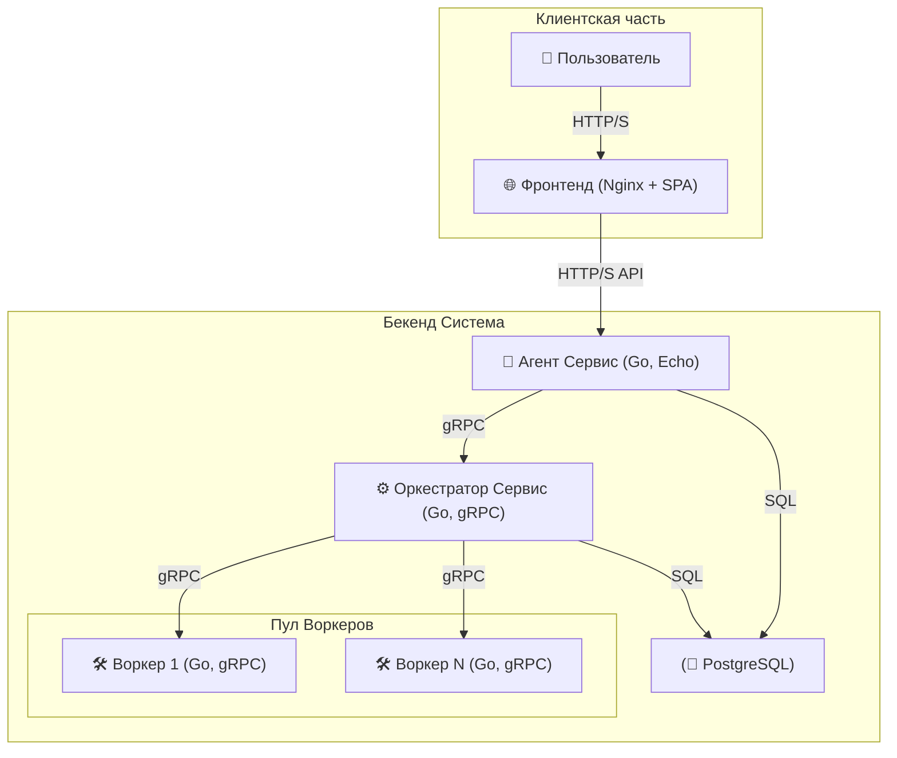
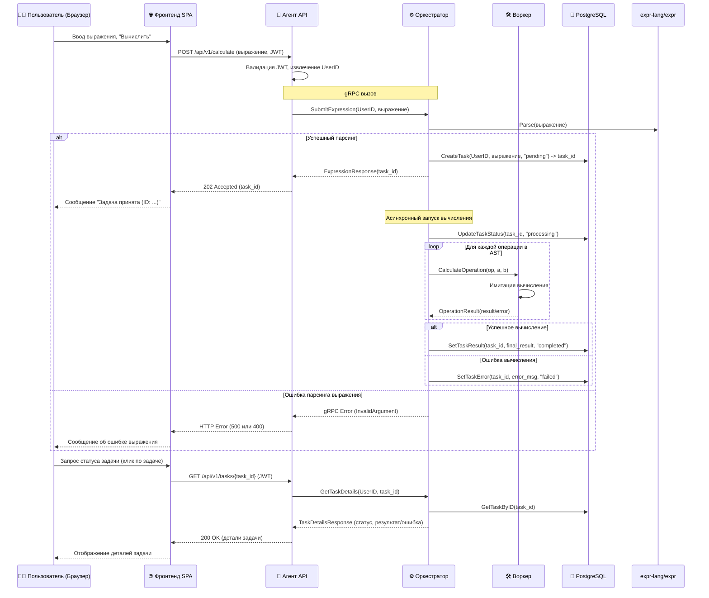
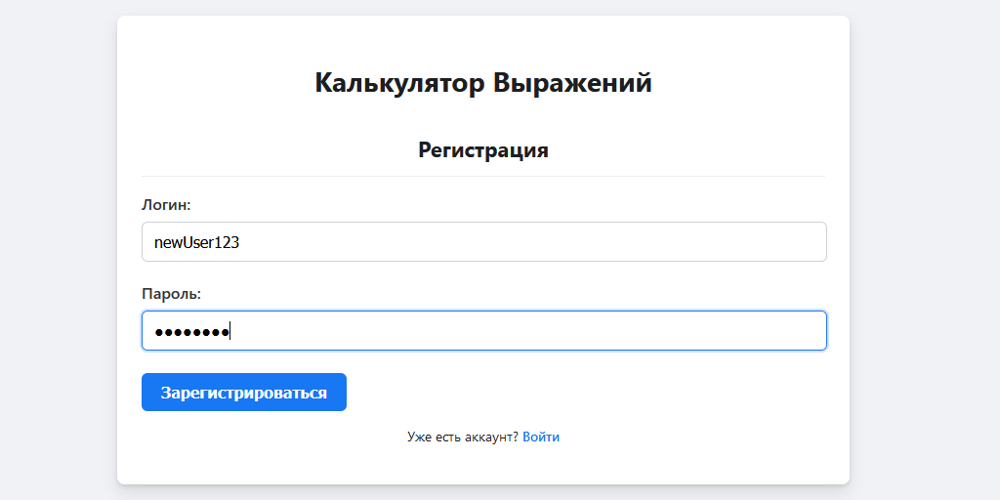
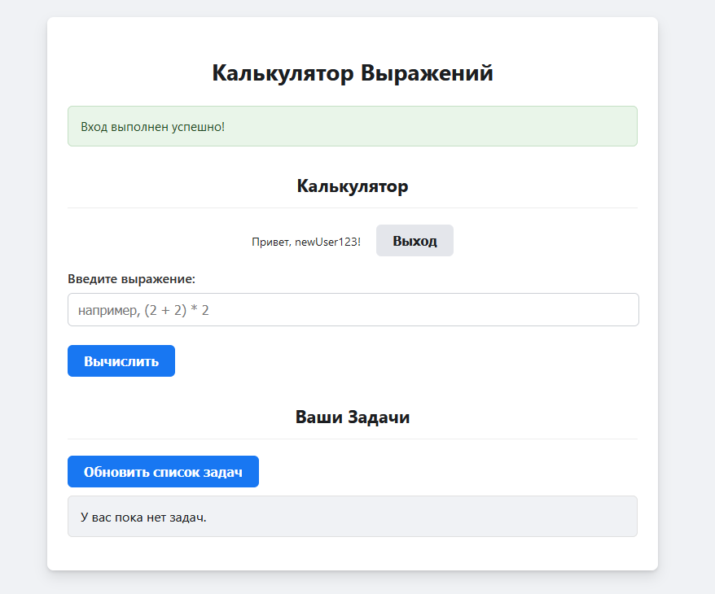
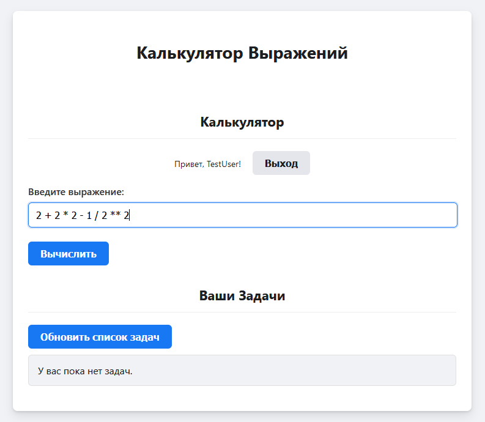
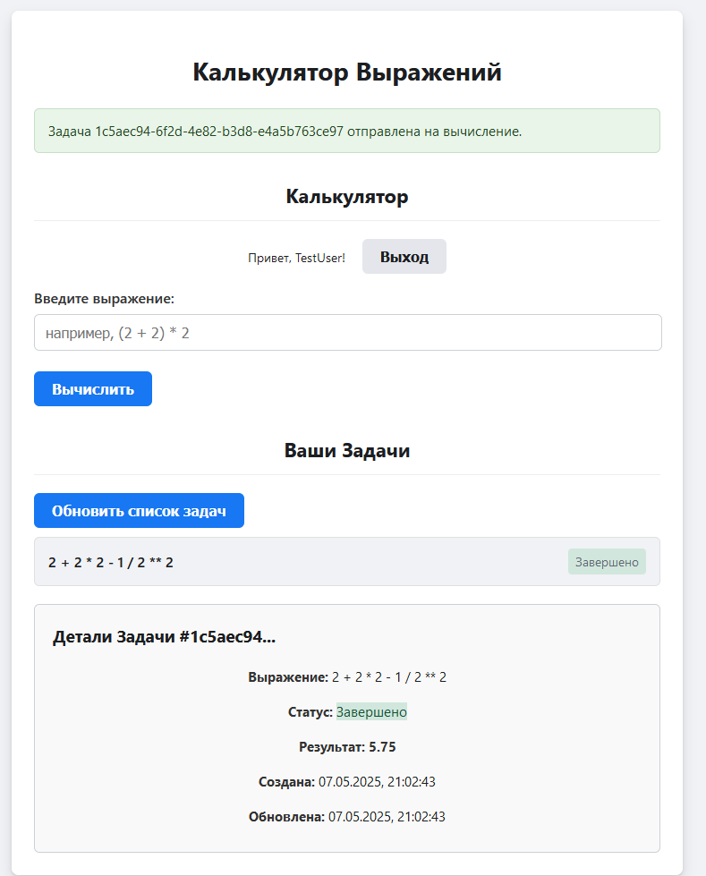
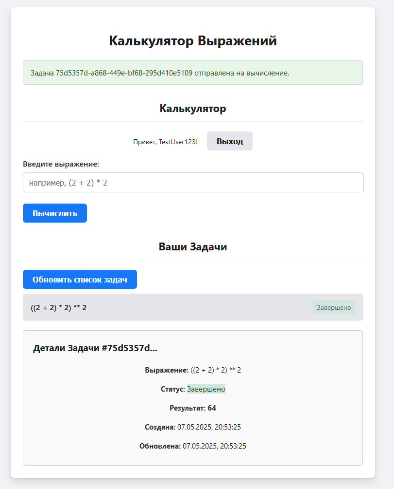
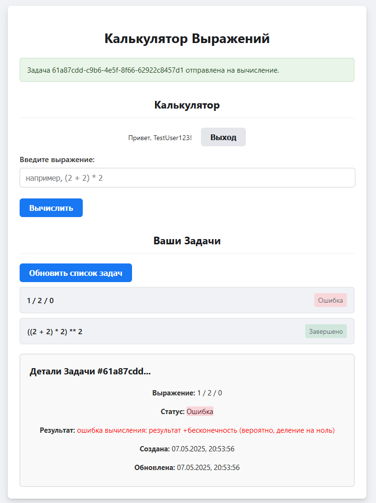
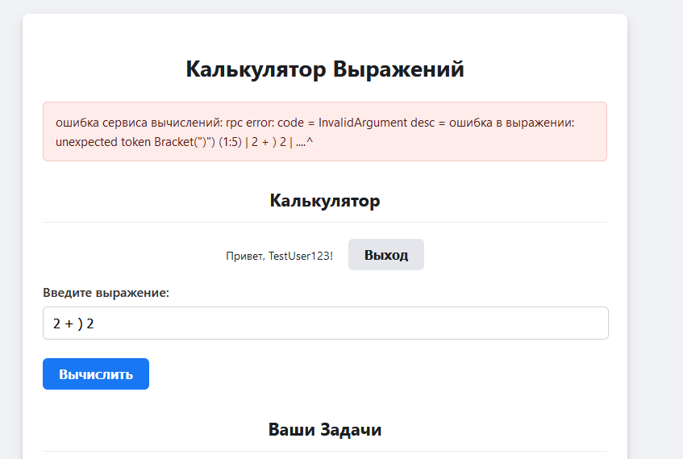
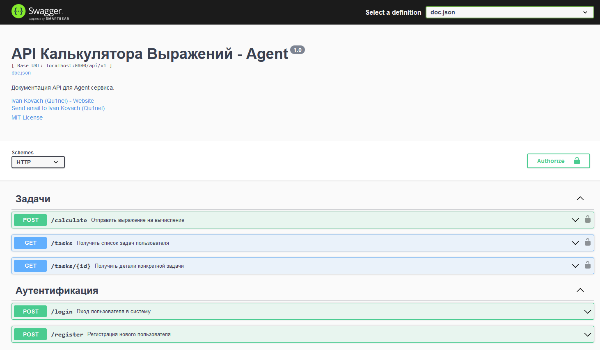

<div align="center">
  
  <h1>Распределённый Калькулятор Выражений Оркестратор-Воркер</h1>

  <p>Сервис для вычисления арифметических выражений с использованием распределенной архитектуры Оркестратор-Воркер, многопользовательским режимом, аутентификацией (JWT) и хранением данных в PostgreSQL.</p>

<p>
  <a href="https://github.com/Qu1nel/YaLyceum-GoProject-Final/graphs/contributors">
    
  </a>
  <a href="https://github.com/Qu1nel/YaLyceum-GoProject-Final/commits/main">
    
  </a>
  <a href="https://github.com/Qu1nel/YaLyceum-GoProject-Final/network/members">
    
  </a>
  <a href="https://github.com/Qu1nel/YaLyceum-GoProject-Final/stargazers">
    
  </a>
  <a href="https://github.com/Qu1nel/YaLyceum-GoProject-Final/issues/">
    
  </a>
</p>
<p>
  <a href="https://go.dev/doc/install" >
    
  <a>
  <a href="https://github.com/Qu1nel/YaLyceum-GoProject-Final/blob/main/LICENSE">
    
  </a>
</p>
<h4>
  <a href="#демонстрация-работы">Просмотреть Демо</a>
  <span> · </span>
  <a href="#-api-документация-и-примеры">Документация API</a>
  <span> · </span>
  <a href="https://github.com/Qu1nel/YaLyceum-GoProject-Final/issues/">Сообщить о баге</a>
  <span> · </span>
  <a href="https://github.com/Qu1nel/YaLyceum-GoProject-Final/issues/">Предложить функционал</a>
</h4>
</div>

<br />

# Содержание

- [🚧 Статус Проекта и TODO](#-статус-проекта-и-todo)
- [О проекте](#о-проекте)
  - [Основные возможности](#основные-возможности)
  - [Поддерживаемые операции](#поддерживаемые-операции)
- [Архитектура](#архитектура)
  - [Общая схема сервисов](#общая-схема-сервисов)
  - [Процесс вычисления выражения](#процесс-вычисления-выражения)
- [Технологический стек](#технологический-стек)
- [Предварительные требования](#предварительные-требования)
- [🚀 Быстрый запуск (Локально)](#-быстрый-запуск-локально)
- [⚙️ Конфигурация](#️-конфигурация)
- [📝 API Документация и Примеры](#-api-документация-и-примеры)
  - [Swagger UI](#swagger-ui)
  - [Примеры `curl` запросов](#примеры-curl-запросов)
    - [Аутентификация](#аутентификация-curl)
    - [Вычисления и Задачи (Требуют JWT)](#вычисления-и-задачи-требуют-jwt-curl)
- [Начало работы с API через Фронтенд](#начало-работы-с-api-через-фронтенд)
- [Структура Проекта](#структура-проекта)
- [✅ Запуск Тестов](#-запуск-тестов)
  - [Все тесты](#все-тесты-юнит--интеграционные)
  - [Юнит-тесты](#юнит-тесты-make-test-unit)
  - [Интеграционные тесты](#интеграционные-тесты-make-test-integration)
  - [Покрытие тестами (Covarage)](#покрытие-тестами-coverage)
- [Демонстрация Работы](#демонстрация-работы)
- [Остановка Приложения](#остановка-приложения)
- [Разработчики](#разработчики)
- [Связь](#связь)
- [Лицензия](#лицензия)

## 🚧 Статус Проекта и TODO

Этот проект представляет собой полнофункциональный прототип распределенного калькулятора выражений. Большая часть требований технического задания реализована и протестирована.

**Задачи на будущее (TODO Future):**
*   **[ ]** Улучшение дизайна и UX фронтенда (Material Design, темы, анимации, футер).
*   **[ ]** Добавление поддержки математических функций (например, `sqrt()`, `log()`, `sin()`, `cos()`) в `ExpressionEvaluator` и Воркеры.
*   **[ ]** Улучшение обработки ошибок и логирования (например, распределенная трассировка).
*   **[ ]** Удаление несущественных комментариев и TODO в коде, улучшение читаемости.
*   **[X]** Улучшение `Makefile` (например, `make test` для запуска всех видов тестов).

## О проекте

Этот проект представляет собой Full-stack веб-приложение "Калькулятор Выражений", реализованное на Go. Ключевые особенности:

*   **Многопользовательский режим:** Регистрация и вход пользователей.
*   **Аутентификация:** Использование JWT (JSON Web Tokens) для защиты API.
*   **Распределенные вычисления:** Задачи вычисления выражений обрабатываются по архитектуре Оркестратор-Воркер.
*   **Асинхронная обработка:** Пользователь отправляет выражение и получает ID задачи, результат можно запросить позже.
*   **Персистентность:** Данные пользователей и задач хранятся в PostgreSQL и сохраняются между перезапусками.
*   **Контекст пользователя:** Все операции с задачами (создание, просмотр) привязаны к конкретному аутентифицированному пользователю.
*   **gRPC:** Взаимодействие между сервисами Agent, Orchestrator и Worker осуществляется через gRPC.

### Основные возможности

*   Регистрация и вход пользователей с использованием JWT для сессий.
*   Отправка арифметических выражений на вычисление.
*   Асинхронная обработка выражений: Оркестратор получает задачу, парсит выражение в AST (Abstract Syntax Tree) с помощью библиотеки `expr-lang/expr`, затем рекурсивно обходит дерево, отправляя отдельные арифметические операции на вычисление Воркерам по gRPC.
*   Получение списка своих задач и их текущего статуса (`pending`, `processing`, `completed`, `failed`).
*   Получение деталей конкретной задачи, включая результат вычисления или сообщение об ошибке.
*   Все операции выполняются в контексте аутентифицированного пользователя.

### Поддерживаемые операции

Парсинг выражений осуществляется с помощью библиотеки `expr-lang/expr`. На данный момент вычислитель поддерживает следующие арифметические операции:

*   Сложение (`+`)
*   Вычитание (`-`)
*   Умножение (`*`)
*   Деление (`/`) (деление на ноль обрабатывается как ошибка задачи со стороны Воркера, результат `+Inf`/`-Inf` от `expr` перехватывается Оркестратором).
*   Возведение в степень (`**` в выражении, транслируется в `^` для Воркера)
*   Унарный минус (например, `-5` или `-(2+2)`)
*   Скобки для управления порядком операций.

*Поддержка стандартных математических функций (sqrt, log, sin, cos и т.д.) может быть добавлена в будущем.*

## Архитектура

### Общая схема сервисов
Система построена на микросервисной архитектуре. Компоненты взаимодействуют через HTTP/S (пользователь <-> Агент) и gRPC (Агент <-> Оркестратор <-> Воркер). Данные хранятся в PostgreSQL.


*   **Пользователь** взаимодействует с **Фронтендом**.
*   **Фронтенд** отправляет запросы к **Агенту**.
*   **Агент** отвечает за аутентификацию (работает с **PostgreSQL** для пользователей) и передает задачи **Оркестратору** по gRPC.
*   **Оркестратор** управляет жизненным циклом задач (сохраняет в **PostgreSQL**), парсит выражения и распределяет элементарные операции между **Воркерами** по gRPC.
*   **Воркеры** выполняют вычисления и возвращают результат Оркестратору.

### Процесс вычисления выражения

Эта диаграмма иллюстрирует упрощенный асинхронный процесс обработки запроса на вычисление:



## Технологический стек

*   **Бекенд:** Go 1.22+ (уточните актуальную версию в `go.mod`)
    *   Веб Фреймворк (Agent): Echo v4
    *   gRPC: [google.golang.org/grpc](google.golang.org/grpc)
    *   База данных: PostgreSQL 15+ (Driver: pgx/v5)
    *   Парсинг выражений: expr-lang/expr
    *   Конфигурация: Viper
    *   Логирование: Zap
    *   DI (Внедрение зависимостей): Fx (uber-go/fx)
    *   Аутентификация: bcrypt (хеширование), JWT (github.com/golang-jwt/jwt/v5)
*   **База данных:** PostgreSQL 15+
*   **Фронтенд:** HTML, CSS, Vanilla JavaScript (раздается через Nginx)
*   **DevOps / Инструменты:**
    *   Docker & Docker Compose
    *   Makefile
    *   API Документация: Swagger/OpenAPI (интегрировано с Echo)
    *   Миграции БД: golang-migrate (SQL скрипты в `/migrations`)
*   **Тестирование:**
    *   Юнит-тесты: Стандартный пакет `testing`, `testify/assert`, `testify/mock`.
    *   Мокирование БД: `pgxmock`.
    *   Интеграционные тесты: `testcontainers-go` (для PostgreSQL), `net/http/httptest`.

## Предварительные требования

Для запуска и разработки проекта вам понадобятся:

*   **Go:** Версия 1.24 или новее. ([Инструкция по установке](https://go.dev/doc/install)) (уточните актуальную версию в `go.mod`)
*   **Docker:** Актуальная версия Docker Engine. ([Инструкция по установке](https://docs.docker.com/engine/install/))
*   **Docker Compose:** Обычно устанавливается вместе с Docker Desktop. ([Инструкция по установке](https://docs.docker.com/compose/install/))
*   **Git:** Для клонирования репозитория.
*   **Make:** Для использования команд из `Makefile` (обычно предустановлен в Linux/macOS, для Windows можно установить через Chocolatey, WSL или Git Bash).
*   **curl:** Для отправки запросов к API из командной строки (опционально).
*   **jq:** (Опционально, рекомендуется) Утилита командной строки для обработки JSON, полезна для извлечения токена. ([Установка jq](https://jqlang.github.io/jq/download/))

## 🚀 Быстрый запуск (Локально)

**КРИТИЧЕСКИ ВАЖНО:** Следуйте этим шагам для корректного запуска всего стека **одной командой `make up`**. Это требование для успешной оценки проекта.

**Для запуска всего стека приложения (Frontend, Agent, Orchestrator, Worker, PostgreSQL) выполните эту команду из корневой директории проекта**

1.  **Клонируйте репозиторий:**
    ```bash
    git clone https://github.com/Qu1nel/YaLyceum-GoProject-Final.git
    cd YaLyceum-GoProject-Final
    ```

2.  **Создайте файл `.env`:**
    Скопируйте файл с примером переменных окружения. Значения по умолчанию подходят для локального запуска.
    ```bash
    cp .env.example .env
    ```
    *Внимание:* Значение `JWT_SECRET` по умолчанию **небезопасно**! Обязательно измените его на надежный случайный ключ (длиной не менее 32 символов) перед использованием вне локальной разработки.

3.  **Запустите все сервисы:**
    Эта **единственная команда** соберет Docker-образы (если необходимо) и запустит все контейнеры (Agent, Postgres, Orchestrator, Worker, Frontend) в фоновом режиме (`-d`). Миграции базы данных будут применены автоматически при первом старте контейнера PostgreSQL.
    ```bash
    make up
    ```
    ИЛИ, если `make` не установлен:
    ```bash
    docker-compose up --build -d
    ```
    Эта команда:
    1.  Соберет Docker-образы для всех Go-сервисов и фронтенда.
    2.  Запустит все контейнеры в фоновом режиме (`-d`).
    3.  Применит миграции базы данных при первом старте PostgreSQL.

4.  **Убедитесь, что все запустилось:**
    *   **Проверьте статус контейнеров:** Убедитесь, что все пять контейнеров (`calculator_frontend`, `calculator_agent`, `calculator_orchestrator`, `calculator_worker`, `calculator_postgres`) запущены и имеют статус `Up` или `running`:
        ```bash
        make ps 
        # Или: docker ps
        ```
        Ожидаемый вывод (примерно):
        ```
        NAME                  COMMAND                  SERVICE             STATUS              PORTS
        calculator_agent      "/app/agent"             agent               running             0.0.0.0:8080->8080/tcp
        calculator_postgres   "docker-entrypoint.s…"   postgres            running             0.0.0.0:5432->5432/tcp
        …
        ```

5.  **Проверьте логи сервисов** на предмет ошибок при старте:
    *   `make logs-agent` (ожидайте: "Запуск HTTP сервера Agent...")
    *   `make logs-orchestrator` (ожидайте: "Запуск gRPC сервера Оркестратора...")
    *   `make logs-worker` (ожидайте: "Запуск gRPC сервера Воркера...")
    *   `make logs-postgres` (ожидайте: "database system is ready to accept connections")
    *   `make logs-frontend` (ожидайте логи Nginx)
    Или `make logs` для просмотра всех логов.

**Доступ к приложению:**

*   **Фронтенд (Пользовательский интерфейс):** `http://localhost:80` (порт из `FRONTEND_PORT`)
*   **API Агента (для Swagger или Postman):** `http://localhost:8080` (порт из `AGENT_HTTP_PORT`)
*   **Swagger UI (API Документация):** `http://localhost:8080/swagger/index.html`

## ⚙️ Конфигурация

Основные параметры конфигурации управляются через переменные окружения. Для локальной разработки создайте файл `.env` в корне проекта на основе `.env.example` и измените значения при необходимости.

| Переменная                    | Сервис(ы)    | Описание                                                    | Значение по умолчанию (из кода) | Пример в `.env`             |
| :---------------------------- | :----------- | :---------------------------------------------------------- | :------------------------------------ | :-------------------------- |
| `APP_ENV`                     | Все Go       | Окружение (`development`, `production`, `test`)             | `development`                         | `APP_ENV=development`       |
| `LOG_LEVEL`                   | Все Go       | Уровень логирования (`debug`, `info`, `warn`, `error`)      | `info`                                | `LOG_LEVEL=debug`           |
| `GRACEFUL_TIMEOUT`            | Все Go       | Таймаут на корректное завершение (например, "5s")           | `5s`                                  | `GRACEFUL_TIMEOUT=10s`      |
| `POSTGRES_DSN`                | Agent, Orch. | Строка подключения к PostgreSQL (в Docker Compose формируется) | *(см. config.go каждого сервиса)* | *(обычно не нужен в .env)*  |
| `DB_POOL_MAX_CONNS`           | Agent, Orch. | Макс. соединений в пуле PostgreSQL                          | `10`                                  | `DB_POOL_MAX_CONNS=15`      |
| `AGENT_HTTP_PORT`             | Agent        | Порт HTTP API Агента                                        | `8080`                                | `AGENT_HTTP_PORT=8080`      |
| `JWT_SECRET`                  | Agent        | **Секретный ключ** для JWT (мин. 32 символа)              | *(длинный дефолт)*                    | `JWT_SECRET="очень_сек...` |
| `JWT_TOKEN_TTL`               | Agent        | Время жизни JWT токена (например, "1h", "15m")              | `1h`                                  | `JWT_TOKEN_TTL=24h`         |
| `ORCHESTRATOR_GRPC_ADDRESS`   | Agent        | Адрес gRPC сервера Оркестратора (для клиента в Агенте)      | `orchestrator_default:50051`          | `orchestrator:50051`        |
| `GRPC_CLIENT_TIMEOUT`         | Agent, Orch. | Таймаут для gRPC вызовов клиентов                         | `5s`                                  | `GRPC_CLIENT_TIMEOUT=3s`    |
| `ORCHESTRATOR_GRPC_PORT`      | Orchestrator | Порт gRPC сервера Оркестратора                             | `50051`                               | `ORCHESTRATOR_GRPC_PORT=50051`|
| `WORKER_GRPC_ADDRESS`         | Orchestrator | Адрес gRPC сервера Воркера (для клиента в Оркестраторе)    | `worker_default:50052`                | `worker:50052`              |
| `WORKER_GRPC_PORT`            | Worker       | Порт gRPC сервера Воркера                                  | `50052`                               | `WORKER_GRPC_PORT=50052`    |
| `TIME_ADDITION_MS`            | Worker       | Имитация времени сложения (например, "200ms")             | `200ms`                               | `TIME_ADDITION_MS=50ms`     |
| `TIME_SUBTRACTION_MS`         | Worker       | Имитация времени вычитания                                  | `200ms`                               | `TIME_SUBTRACTION_MS=50ms`  |
| `TIME_MULTIPLICATION_MS`      | Worker       | Имитация времени умножения                                  | `300ms`                               | `TIME_MULTIPLICATION_MS=70ms` |
| `TIME_DIVISION_MS`            | Worker       | Имитация времени деления                                    | `400ms`                               | `TIME_DIVISION_MS=80ms`     |
| `TIME_EXPONENTIATION_MS`      | Worker       | Имитация времени возведения в степень                       | `500ms`                               | `TIME_EXPONENTIATION_MS=100ms`|
| `FRONTEND_PORT`               | Frontend     | Порт, на котором Nginx раздает фронтенд                      | `80`                                  | `FRONTEND_PORT=8000`        |

*Для Docker Compose актуальные значения переменных окружения для контейнеров задаются в файле `docker-compose.yml` и могут браться из вашего локального `.env` файла.*

## 📝 API Документация и Примеры

### Swagger UI

Полная интерактивная документация API доступна через Swagger UI после запуска сервисов по адресу:
**`http://localhost:8080/swagger/index.html`** или **`http://localhost:8080/swagger/`**
(Замените `8080` на порт вашего Agent сервиса из `AGENT_HTTP_PORT`, если он отличается от значения по умолчанию).
Swagger UI позволяет просматривать все эндпоинты, их параметры, тела запросов и ответов, а также выполнять запросы прямо из браузера.

### Примеры `curl` запросов

**Базовый URL API Агента:** `http://localhost:8080/api/v1` (далее `$BASE_URL`)

Для удобства, сохраните JWT токен, полученный после входа (благодаря `jq`), в переменную:
```bash
# После успешного логина, извлеките токен из JSON ответа
# Пример с jq:
# TOKEN=$(curl -s -X POST -H "Content-Type: application/json" -d '{"login": "user_for_curl_tests", "password": "strongPassword123"}' $BASE_URL/login | jq -r .token)
# echo $TOKEN
# Либо скопируйте вручную.
```

#### Аутентификация (curl)

0. **Удобный `BASE_URL`:**
    ```bash
    export BASE_URL="http://localhost:8080/api/v1"
    ```

1.  **Регистрация нового пользователя:**
    ```bash
    curl -i -X POST \
      -H "Content-Type: application/json" \
      -d '{"login": "user_for_curl_tests", "password": "strongPassword123"}' \
      $BASE_URL/register
    ```
    *Успех (200 OK):* `{"message":"Пользователь успешно зарегистрирован"}`
    *Ошибка (409 Conflict):* `{"error":"пользователь с таким логином уже существует"}`
    *Ошибка (400 Bad Request, короткий пароль):* `curl -i -X POST -H "Content-Type: application/json" -d '{"login": "new_user_short_pass", "password": "123"}' $BASE_URL/register` -> `{"error":"неверный формат пароля (минимум 6 символов)"}`

2.  **Вход пользователя:**
    ```bash
    curl -i -X POST \
      -H "Content-Type: application/json" \
      -d '{"login": "user_for_curl_tests", "password": "strongPassword123"}' \
      $BASE_URL/login
    ```
    *Успех (200 OK):* `{"token":"eyJhbGciOiJIUzI1NiIsInR5cCI6IkpXVCJ9.eyJleHAiOjE3..."}`
    *Ошибка (401 Unauthorized):* `{"error":"неверный логин или пароль"}`

#### Вычисления и Задачи (Требуют JWT) (curl)

Предположим, токен сохранен в `$TOKEN`.

3.  **Отправка выражения на вычисление:**
    ```bash
    curl -i -X POST \
      -H "Content-Type: application/json" \
      -H "Authorization: Bearer $TOKEN" \
      -d '{"expression": "(10 + (4 * 2)) / (6 - 3)"}' \
      $BASE_URL/calculate
    ```
    *Успех (202 Accepted):* `{"task_id":"<uuid_задачи>"}`
    *Ошибка (400 Bad Request - пустое выражение):* `curl -i -X POST -H "Content-Type: application/json" -H "Authorization: Bearer $TOKEN" -d '{"expression": ""}' $BASE_URL/calculate` -> `{"error":"Поле 'expression' не может быть пустым"}`
    *Ошибка (Невалидное выражение, например, `2++`):*
    ```bash
    curl -i -X POST \
      -H "Content-Type: application/json" \
      -H "Authorization: Bearer $TOKEN" \
      -d '{"expression": "2++"}' \
      $BASE_URL/calculate
    ```
    Ответ: Статус 500 (или 400, если обработка gRPC ошибок в Агенте будет уточнена), тело: `{"error":"ошибка сервиса вычислений: ошибка в выражении: unexpected token Add (\"+\") (1:2)..."}`

4.  **Получение списка задач пользователя:**
    ```bash
    curl -i -X GET \
      -H "Authorization: Bearer $TOKEN" \
      $BASE_URL/tasks
    ```
    *Успех (200 OK):* `[{"id":"...","expression":"...","status":"...","created_at":"..."}, ...]`

5.  **Получение деталей конкретной задачи:**
    (Замените `<TASK_ID>` на реальный ID)
    ```bash
    curl -i -X GET \
      -H "Authorization: Bearer $TOKEN" \
      $BASE_URL/tasks/<TASK_ID>
    ```
    *Успех (200 OK, задача `completed`):* `{"id":"...","expression":"...","status":"completed","result":6.0,"created_at":"...","updated_at":"..."}`
    *Успех (200 OK, задача `failed` из-за `1/0`):* `{"id":"...","expression":"1 / 0","status":"failed","error_message":"ошибка вычисления: результат +бесконечность (вероятно, деление на ноль)","created_at":"...","updated_at":"..."}`
    *Ошибка (404 Not Found - задача не найдена / чужая):* `{"error":"задача не найдена или нет прав доступа: rpc error: code = NotFound desc = задача с ID ... не найдена (или нет прав доступа)"}`
    *Ошибка (400 Bad Request - невалидный формат ID):* `curl -i -X GET -H "Authorization: Bearer $TOKEN" $BASE_URL/tasks/not-a-uuid` -> `{"error":"Невалидный формат ID задачи"}`

6.  **Ошибки Аутентификации для `/tasks`:**
    *   Без токена: `curl -i -X GET $BASE_URL/tasks` -> `401 Unauthorized`, `{"error":"Отсутствует токен авторизации"}`
    *   С невалидным токеном: `curl -i -X GET -H "Authorization: Bearer invalid.token" $BASE_URL/tasks` -> `401 Unauthorized`, `{"error":"Невалидный или истекший токен авторизации"}`

## Начало работы с API через Фронтенд
После запуска всех сервисов (`make up`), откройте в браузере:
**`http://localhost`** (или порт, указанный в `FRONTEND_PORT` в вашем `.env` файле, по умолчанию 80).

Вам будет доступен интерфейс для:
1.  Регистрации нового пользователя.
2.  Входа в систему.
3.  Отправки выражений на вычисление.
4.  Просмотра списка своих задач и их статусов (обновляется по кнопке и после отправки нового выражения).
5.  Просмотра деталей конкретной задачи (клик по задаче в списке).

## Структура Проекта

```
YaLyceum-Go-Project-Final/
├── .github/              # Файлы конфигурации GitHub (Workflows, шаблоны и т.д.)
├── cmd/                  # Точки входа для каждого Go-сервиса
│   ├── agent/            # Сервис Agent (HTTP API, Auth, gRPC клиент)
│   │   ├── Dockerfile
│   │   └── main.go
│   ├── orchestrator/     # Сервис Orchestrator (gRPC сервер, логика задач, БД)
│   │   ├── Dockerfile
│   │   └── main.go
│   └── worker/           # Сервис Worker (gRPC сервер, вычисления)
│       ├── Dockerfile
│       └── main.go
├── docs/                 # Сгенерированная документация
│   ├── images/           # Изображения демонстрации работы приложения (веб)
│   └── agent_api/        # Файлы Swagger для Agent API
│       ├── docs.go
│       ├── swagger.json
│       └── swagger.yaml
├── internal/             # Внутренняя логика сервисов (не для внешнего импорта)
│   ├── agent/            # Код, специфичный для Agent
│   │   ├── app/
│   │   │   └── app.go
│   │   ├── client/
│   │   │   └── orchestrator_grpc.go
│   │   ├── config/
│   │   │   └── config.go
│   │   ├── handler/
│   │   │   ├── auth.go
│   │   │   └── task.go
│   │   ├── middleware/
│   │   │   └── auth.go
│   │   ├── repository/
│   │   │   └── user_postgres.go
│   │   └── service/
│   │       ├── mocks/
│   │       │   └── orchestrator_service_client_mock.go
│   │       ├── auth.go
│   │       ├── task.go
│   │       └── task_test.go
│   ├── orchestrator/     # Код, специфичный для Orchestrator
│   │   ├── app/
│   │   │   └── app.go
│   │   ├── client/
│   │   │   └── worker_grpc.go
│   │   ├── config/
│   │   │   └── config.go
│   │   ├── grpc_handler/
│   │   │   ├── orchestrator_server.go
│   │   │   └── orchestrator_server_test.go
│   │   ├── repository/
│   │   │   ├── mocks/
│   │   │   │   └── task_repository_mock.go
│   │   │   ├── db_iface.go
│   │   │   ├── task_postgres.go
│   │   │   └── task_postgres_test.go
│   │   └── service/
│   │       ├── mocks/
│   │       │   ├── evaluator_mock.go
│   │       │   └── worker_service_client_mock.go
│   │       ├── evaluator.go
│   │       └── evaluator_test.go
│   ├── pkg/              # Общие внутренние пакеты (логгер, хешер, БД, shutdown)
│   │   ├── hasher/
│   │   │   └── bcrypt.go
│   │   ├── jwtauth/
│   │   │   └── jwtauth.go
│   │   ├── logger/
│   │   │   └── logger.go
│   │   ├── postgres/
│   │   │   └── postgres.go
│   │   └── shutdown/
│   │       └── shutdown.go
│   └── worker/           # Код, специфичный для Worker
│       ├── app/
│       │   └── app.go
│       ├── config/
│       │   └── config.go
│       ├── grpc_handler/
│       │   ├── worker_server.go
│       │   └── worker_server_test.go
│       └── service/
│           ├── mocks/
│           │   └── calculator_service_mock.go
│           ├── calculator.go
│           └── calculator_test.go
├── migrations/           # SQL-скрипты для миграций базы данных (golang-migrate)
│   └── 000001_init.sql
├── proto/                # Определения Protocol Buffers для gRPC
│   ├── gen/              # Сгенерированный Go-код из .proto файлов
│   │   ├── orchestrator/
│   │   │   ├── orchestrator.pb.go
│   │   │   └── orchestrator_grpc.pb.go
│   │   └── worker/
│   │       ├── worker.pb.go
│   │       └── worker_grpc.pb.go
│   ├── orchestrator.proto
│   └── worker.proto
├── tests/                # Тесты
│   └── migrations/       # SQL-скрипты для миграции БД для тестов
│   │   ├── 000001_init.down.sql
│   │   └── 000001_init.up.sql
│   └── integration/      # Интеграционные тесты
│       ├── agent_api_test.go
│       └── setup_test.go
├── web/                  # Файлы фронтенда
│   └── frontend/         # HTML, CSS, JavaScript для SPA
│       ├── Dockerfile
│       ├── app.js
│       ├── index.html
│       ├── nginx.conf
│       └── style.css
├── .dockerignore
├── .env                  # Функциональный файл переменных окружения
├── .env.example          # Пример файла переменных окружения
├── .gitattributes
├── .gitignore
├── .pre-commit-config.yaml
├── LICENSE
├── Makefile              # Удобные команды для сборки, запуска, тестов
├── README.md             # Эта документация
├── docker-compose.yml    # Определение и запуск всех сервисов Docker
├── go.mod                # Зависимости Go-проекта
└── go.sum
```

Краткое описание структуры директорий:
*   `cmd/`: Точки входа для каждого сервиса (Agent, Orchestrator, Worker).
*   `docs/`: Сгенерированная Swagger-документация.
*   `internal/`: Внутренняя логика, специфичная для каждого сервиса (хендлеры, сервисы, репозитории). Код из `internal` не может быть импортирован другими проектами.
    *   `internal/agent/`: Код сервиса Агента.
    *   `internal/orchestrator/`: Код сервиса Оркестратора.
    *   `internal/worker/`: Код сервиса Воркера.
    *   `internal/pkg/`: Общие пакеты, используемые *внутри* этого проекта несколькими сервисами (например, хелперы для БД, логгер, хешер).
*   `migrations/`: SQL-скрипты для миграций базы данных.
*   `proto/`: Файлы `.proto` для gRPC и сгенерированный из них Go-код (`gen`).
*   `tests/integration/`: Интеграционные тесты.
*   `web/frontend/`: Статические файлы фронтенда (HTML, CSS, JS) и его Dockerfile.
*   `Makefile`: Утилиты для сборки, запуска, тестирования.
*   `docker-compose.yml`: Определение и оркестровка Docker-контейнеров.
*   `.env.example`, `.env`: Файлы конфигурации переменных окружения.
*   `go.mod`, `go.sum`: Файлы управления зависимостями Go.

## ✅ Запуск Тестов

Этот проект включает в себя как юнит-тесты для отдельных компонентов, так и интеграционные тесты для проверки взаимодействия сервисов. Используйте `Makefile` для удобного запуска тестов.

### Все тесты (Юнит + Интеграционные)

Для запуска полного набора тестов (сначала все юнит-тесты, затем все интеграционные тесты) используйте команду:
```bash
make test
```
Эта команда последовательно выполнит `make test-unit` и `make test-integration`.

### Юнит-тесты (`make test-unit`)

Юнит-тесты проверяют изолированные части кода (функции, методы) в каждом сервисе. Они не требуют Docker или запущенных внешних зависимостей (кроме моков).

**Запустить все юнит-тесты:**
```bash
make test-unit
```
Эта команда попытается автоматически определить пакеты в директории `internal/`, содержащие файлы `*_test.go` (используя `find` на Linux/macOS или аналогичные подходы). Если автоматическое определение не удается (например, в некоторых окружениях Windows без Unix-утилит), будет использован предопределенный список основных тестовых пакетов или более общая команда `go test ./internal/...`. Команда исключает директории с моками (`mocks/`).

Вы увидите список пакетов, которые будут протестированы, в выводе команды.

**Запустить юнит-тесты для конкретного пакета вручную:**
Например, для сервисного слоя агента:
```bash
go test -v -count=1 ./internal/agent/service/...
```
*(Флаг `-count=1` отключает кэширование тестов. Используйте `-cover` для отображения покрытия по пакетам в консоли)*.

### Интеграционные тесты (`make test-integration`)

Интеграционные тесты проверяют взаимодействие между различными компонентами системы (например, API Агента -> Оркестратор -> Воркер -> База данных).

**Требования:** Для запуска интеграционных тестов необходим запущенный Docker Engine.

**Запустить все интеграционные тесты:**
```bash
make test-integration
```
Эта команда выполнит тесты из директории `tests/integration/`. `TestMain` в этом пакете автоматически настроит тестовое окружение:
*   Поднимет контейнер PostgreSQL с помощью `testcontainers-go`.
*   Применит миграции базы данных.
*   Запустит сервисы Agent, Orchestrator и Worker как Go-процессы для тестирования.

**Запуск тестов вручную (альтернатива `make`):**
```bash
# Очистка кеша для гарантированно свежей сборки
go clean -cache
go clean -testcache
# Запуск тестов с флагом -a для принудительной пересборки пакетов
go test -v -a ./tests/integration/...
```

### Покрытие тестами (Coverage)

Вы можете сгенерировать отчет о покрытии кода юнит-тестами.

1.  **Сгенерировать профиль покрытия (`coverage.out`):**
    ```bash
    make test-coverage
    ```
    Эта команда запустит юнит-тесты для автоматически определенных или предопределенных пакетов и создаст файл `coverage.out`.

2.  **Сгенерировать HTML-отчет о покрытии:**
    ```bash
    make test-coverage-html
    ```
    Эта команда использует `coverage.out` для создания интерактивного HTML-отчета `coverage.html`. Откройте этот файл в браузере, чтобы увидеть детальное покрытие кода.

    Если файл `coverage.out` не найден, команда выведет соответствующее сообщение. После успешной генерации вы увидите путь к файлу `coverage.html`.


## Демонстрация Работы

Последовательная работа с сервисом через фронтенд:

1. Главная страница фронтенда (форма входа/регистрации).
   Стартовая страница приложения, предлагающая войти или зарегистрироваться.

<div align="center">
   
</div>

2. Интерфейс после входа с формой ввода выражения и списком задач.
   Основной интерфейс после входа: форма для ввода математического выражения, список ранее отправленных задач с их статусами.

<div align="center">
   
</div>

3. Скриншот с вводом выражения в поле.
   Просмотр процесса ввода выражения в поле, после успешного входа.

<div align="center">
   
</div>

4. Скриншот с деталями задач, который завершились успешно..
   Просмотр деталей задачи, завершившейся ошибкой, с отображением сообщения об ошибке.

<div align="center">
   
   
</div>

5. Скриншот с деталями задачи, завершившейся ошибкой (например, деление на ноль).
   Просмотр деталей задачи, завершившейся ошибкой, с отображением сообщения об ошибке.

<div align="center">
   
   
</div>

5. (Опционально) Скриншот Swagger UI.
   Интерфейс Swagger UI, демонстрирующий доступные эндпоинты API.

<div align="center">
   
</div>


## Остановка Приложения
Для остановки всех сервисов, запущенных через Docker Compose, и удаления контейнеров и томов (включая данные БД!):
```bash
make down
```
Чтобы просто остановить контейнеры без удаления данных:
```bash
make stop
```

## Разработчики
*   [Ivan Kovach (Qu1nel)](https://github.com/Qu1nel)

## Связь
*   Telegram: [`@qnllnq`](https://t.me/qnllnq)
*   Email: `covach.qn@gmail.com`

## Лицензия
[MIT](./LICENSE) © Ivan Kovach