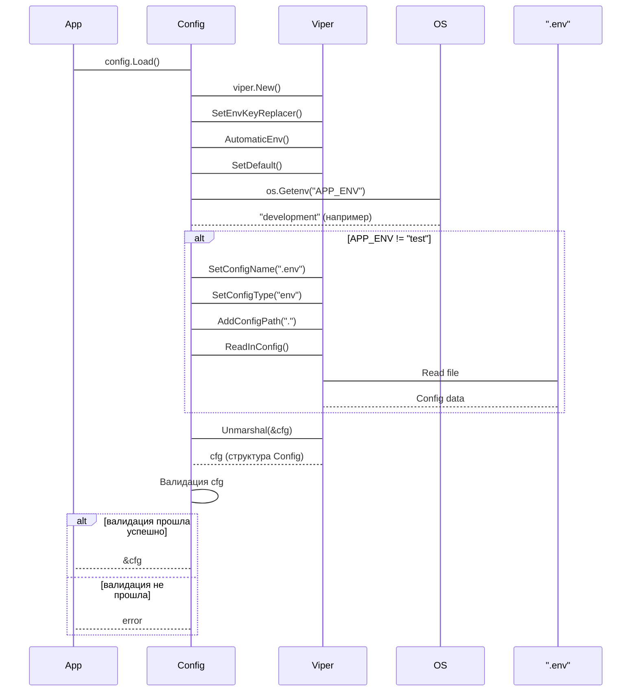

# Chapter 1: Конфигурация (Config)

Добро пожаловать в первую главу нашего руководства по проекту `YaLyceum-GoProject-Final`!  Мы рады, что вы здесь.

В этой главе мы поговорим о **Конфигурации (Config)**.  Это как пульт управления для нашего приложения. Без конфигурации, нашему приложению будет сложно понять, как правильно работать в разных ситуациях.

## Зачем нам Конфигурация?

Представьте, что вы переезжаете в новый дом. Вам нужно подключить свет, воду, интернет. Все эти подключения требуют настройки: куда вставить вилку, какой пароль от Wi-Fi и т.д.  **Конфигурация** для приложения - это то же самое! Она говорит приложению, где найти базу данных, какой порт использовать для приема запросов, и много других важных деталей.

Центральный пример: представьте, что вы запускаете наше приложение в разных местах:
1.  **На вашем компьютере (Разработка):**  Нужно использовать локальную базу данных и порты, доступные только вам.
2.  **На сервере для тестирования (Тестирование):** Нужно подключиться к тестовой базе данных и использовать другие порты.
3.  **На сервере для реальных пользователей (Продакшн):** Здесь используются реальные базы данных, защищенные порты и другие важные настройки.

Без конфигурации, мы должны были бы изменять код приложения каждый раз, когда мы переносим его из одного места в другое. Это очень неудобно и может привести к ошибкам. **Конфигурация позволяет нам изменять настройки приложения, не трогая сам код!**

## Ключевые концепции Конфигурации

Конфигурация в нашем проекте состоит из нескольких ключевых концепций:

1.  **Переменные окружения (Environment variables):** Это как секретные коды, которые "видны" только приложению в конкретной среде. Например, `DATABASE_URL` может указывать на адрес базы данных.

2.  **.env файл:** Это текстовый файл, где мы храним значения переменных окружения для удобства. Он особенно полезен при разработке, чтобы не прописывать переменные окружения каждый раз вручную.  *Важно: Никогда не храните секретные данные (пароли, ключи) в файле .env, если вы собираетесь выкладывать код в публичный репозиторий!*

3.  **Структура Config (Config struct):** Это Go структура, которая определяет, какие параметры конфигурации нам нужны и как они называются.

4.  **Библиотека Viper:** Мы используем библиотеку [Viper](https://github.com/spf13/viper) для загрузки и управления конфигурацией. Viper умеет читать переменные окружения, .env файлы и значения по умолчанию.

## Как использовать Конфигурацию?

Давайте рассмотрим пример использования конфигурации на примере `internal/agent/config/config.go`.

**Задача:** Мы хотим узнать, какой порт использует Агент для приема HTTP запросов.

1.  **Загрузка конфигурации:**  Сначала нужно загрузить конфигурацию с помощью функции `config.Load()`.

    ```go
    package main

    import (
    	"log"
    	"YaLyceum-GoProject-Final/internal/agent/config"
    )

    func main() {
    	cfg, err := config.Load()
    	if err != nil {
    		log.Fatalf("Ошибка загрузки конфигурации: %v", err)
    		return
    	}

    	// ... дальше работаем с конфигурацией
    }
    ```

    Здесь мы вызываем `config.Load()`, которая читает переменные окружения и .env файл, и заполняет структуру `Config`. Если произошла ошибка, программа завершается.

2.  **Получение значения порта:**  Теперь мы можем получить значение порта из структуры `Config`.

    ```go
    package main

    import (
    	"fmt"
    	"log"
    	"YaLyceum-GoProject-Final/internal/agent/config"
    )

    func main() {
    	cfg, err := config.Load()
    	if err != nil {
    		log.Fatalf("Ошибка загрузки конфигурации: %v", err)
    		return
    	}

    	port := cfg.Server.Port
    	fmt.Printf("Агент слушает на порту: %s\n", port)
    }
    ```

    В этом примере мы получаем значение поля `Port` из структуры `ServerConfig`, которая является частью структуры `Config`.  Результат будет выглядеть так:

    ```
    Агент слушает на порту: 8080
    ```

    Если переменная окружения `AGENT_HTTP_PORT` не задана, то будет использовано значение по умолчанию ("8080").

## Что происходит под капотом?

Давайте разберемся, что происходит, когда мы вызываем `config.Load()`.

1.  **Инициализация Viper:**  Создается новый экземпляр `viper.Viper`.

2.  **Настройка Viper:**
    *   Устанавливается разделитель для переменных окружения (`. заменяется на _`). Это позволяет нам использовать переменные окружения с точками в именах (например, `server.port` становится `SERVER_PORT`).
    *   Включается автоматическое чтение переменных окружения.
    *   Устанавливаются значения по умолчанию для различных параметров конфигурации (например, порт по умолчанию "8080").

3.  **Чтение .env файла:**  Если `APP_ENV` не равно "test", Viper пытается прочитать .env файл.  Если файл не найден, выводится предупреждение, и используются переменные окружения или значения по умолчанию.  Если файл найден, значения из .env файла перезаписывают значения по умолчанию.

4.  **Разбор конфигурации:**  Viper использует `v.Unmarshal(&cfg)` для заполнения структуры `Config` значениями из переменных окружения, .env файла и значений по умолчанию.

5.  **Проверка конфигурации:**  Проверяются обязательные параметры конфигурации (например, порт, URL базы данных, секретный ключ JWT) на наличие ошибок или дефолтных значений, чтобы убедиться, что приложение настроено правильно. Если что-то не так, возвращается ошибка.

Вот как это выглядит на диаграмме последовательности:



Теперь посмотрим на код `internal/agent/config/config.go` ближе:

```go
package config

import (
	"fmt"
	"log"
	"os"
	"strings"
	"time"

	"github.com/spf13/viper"
)

type Config struct { // структура конфигурации
	AppEnv             string           `mapstructure:"APP_ENV"`
	Server             ServerConfig     `mapstructure:",squash"`
	Database           DatabaseConfig   `mapstructure:",squash"`
	JWT                JWTConfig        `mapstructure:",squash"`
	Logger             LoggerConfig     `mapstructure:",squash"`
	GracefulTimeout    time.Duration    `mapstructure:"GRACEFUL_TIMEOUT"`
	OrchestratorClient GRPCClientConfig `mapstructure:",squash"`
}
// ...остальные структуры конфигов
func Load() (*Config, error) {
	v := viper.New() // Создаём новый экземпляр viper

	v.SetEnvKeyReplacer(strings.NewReplacer(".", "_")) // Заменяем "." на "_" в переменных окружения
	v.AutomaticEnv() // Включаем автоматическое чтение переменных окружения

	// Устанавливаем значения по умолчанию
	v.SetDefault("APP_ENV", "development")
	v.SetDefault("AGENT_HTTP_PORT", "8080")

	// ... (остальные дефолтные значения)

	if appEnv := os.Getenv("APP_ENV"); appEnv != "test" {
		v.SetConfigName(".env")
		v.SetConfigType("env")
		v.AddConfigPath(".")
		if err := v.ReadInConfig(); err != nil {
			if _, ok := err.(viper.ConfigFileNotFoundError); ok {
				log.Println("Файл .env не найден, используются переменные окружения/дефолты.")
			} else {
				log.Printf("Предупреждение: ошибка чтения файла .env: %v (игнорируется)", err)
			}
		}
	}

	var cfg Config
	if err := v.Unmarshal(&cfg); err != nil { // Заполняем структуру Config
		return nil, fmt.Errorf("ошибка разбора конфигурации Агента: %w", err)
	}

    // Проверка обязательных параметров
	if cfg.Server.Port == "" {
		return nil, fmt.Errorf("AGENT_HTTP_PORT (из env или default) не установлен")
	}

	return &cfg, nil
}
```

В этом коде мы видим, как используется `viper` для загрузки конфигурации.  `mapstructure` tags в структуре `Config` указывают, какие переменные окружения соответствуют полям структуры.  `squash` говорит viper'у, что поля подструктур нужно "раздавить" в главную структуру.  Например, `ServerConfig.Port` соответствует переменной окружения `AGENT_HTTP_PORT`.

Также можно посмотреть примеры конфигурации для [Оркестратора](05_оркестратор.md) и [Воркера](06_воркер.md) в файлах `internal/orchestrator/config/config.go` и `internal/worker/config/config.go` соответственно. Они используют аналогичный подход.

## Заключение

В этой главе мы узнали, что такое **Конфигурация** и зачем она нужна.  Мы рассмотрели, как использовать библиотеку `Viper` для загрузки конфигурации из переменных окружения и .env файла.  Теперь вы знаете, как настроить приложение для работы в разных окружениях.

В следующей главе мы поговорим о [JWT Аутентификации](02_jwt_аутентификация.md), которая используется для защиты наших API.