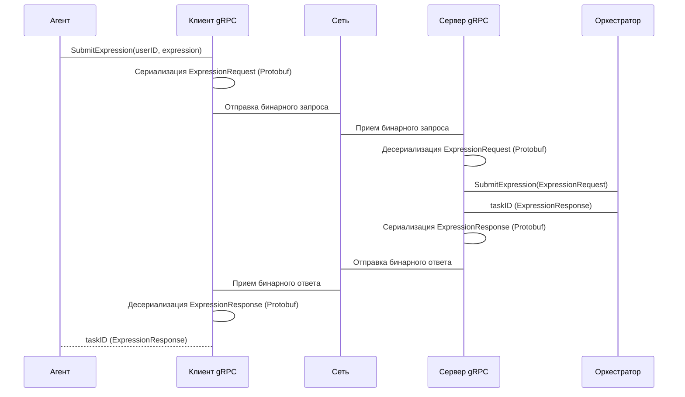

# Chapter 4: gRPC Интерфейсы

После того, как мы узнали об [Агенте](03_агент.md), который принимает запросы от пользователей, пришло время разобраться, как Агент взаимодействует с другими сервисами. Для этого мы используем **gRPC Интерфейсы**.

Представьте, что у вас есть два друга, которые говорят на разных языках. Чтобы они могли общаться, вам нужен переводчик, который знает оба языка и может переводить сообщения между ними. **gRPC Интерфейсы** - это как переводчики для наших сервисов. Они позволяют сервисам общаться друг с другом, даже если они написаны на разных языках программирования или работают на разных платформах.

Центральный пример: Агент написан на Go, а Оркестратор тоже написан на Go. Они должны общаться, чтобы Агент мог передавать задачи на вычисление Оркестратору. **gRPC** позволяет нам определить стандартизированный протокол для обмена данными между ними.

## Зачем нам gRPC Интерфейсы?

Без **gRPC Интерфейсов**, нам пришлось бы придумывать свои собственные способы общения между сервисами. Это было бы сложно, ненадежно и трудно поддерживать. **gRPC Интерфейсы** предоставляют нам:

1.  **Стандартизацию:** gRPC определяет четкий формат для запросов и ответов, что облегчает разработку и отладку.
2.  **Эффективность:** gRPC использует протокол бинарной сериализации (Protocol Buffers), который более эффективен, чем текстовые форматы, такие как JSON. Это делает общение между сервисами быстрее и экономичнее.
3.  **Поддержку разных языков:** gRPC поддерживает множество языков программирования, что позволяет сервисам, написанным на разных языках, легко общаться друг с другом.
4.  **Надежность:** gRPC предоставляет механизмы для обработки ошибок и повторных попыток, что делает общение между сервисами более надежным.

## Ключевые концепции gRPC Интерфейсов

gRPC Интерфейсы состоят из нескольких ключевых концепций:

1.  **Protocol Buffers (Protobuf):** Это как язык, на котором "разговаривают" наши сервисы. Protobuf определяет структуру данных, которыми обмениваются сервисы. Мы определяем сообщения (messages) и сервисы (services) в файлах `.proto`.
2.  **Сообщения (Messages):** Это как слова в языке Protobuf. Сообщения определяют формат данных, которые передаются между сервисами. Например, сообщение `ExpressionRequest` может содержать поле `expression` типа `string`.
3.  **Сервисы (Services):** Это как глаголы в языке Protobuf. Сервисы определяют методы (methods), которые сервисы могут вызывать друг у друга. Например, сервис `OrchestratorService` может содержать метод `SubmitExpression`, который принимает сообщение `ExpressionRequest` и возвращает сообщение `ExpressionResponse`.
4.  **gRPC (gRPC Remote Procedure Call):** Это как протокол общения, который использует язык Protobuf. gRPC позволяет одному сервису вызывать методы другого сервиса, как будто они находятся в одном приложении.

## Как использовать gRPC Интерфейсы?

Давайте рассмотрим, как Агент использует gRPC для отправки выражения на вычисление Оркестратору.

**Задача:** Агент хочет отправить выражение `(2+2)*4` Оркестратору.

1.  **Определение Protobuf:** Сначала мы определяем сообщения и сервисы в файле `proto/orchestrator.proto`.

    ```protobuf
    syntax = "proto3";

    package orchestrator;

    service OrchestratorService {
      rpc SubmitExpression (ExpressionRequest) returns (ExpressionResponse) {}
    }

    message ExpressionRequest {
      string user_id = 1;
      string expression = 2;
    }

    message ExpressionResponse {
      string task_id = 1;
    }
    ```

    Здесь мы определяем сервис `OrchestratorService` с методом `SubmitExpression`, который принимает сообщение `ExpressionRequest` (содержащее `user_id` и `expression`) и возвращает сообщение `ExpressionResponse` (содержащее `task_id`).

2.  **Генерация кода:** Затем мы используем `protoc` (компилятор Protobuf) для генерации Go кода из файла `proto/orchestrator.proto`.

    ```bash
    protoc --go_out=. --go-grpc_out=. proto/orchestrator.proto
    ```

    Эта команда генерирует файлы `orchestrator.pb.go` и `orchestrator_grpc.pb.go`, которые содержат Go структуры и интерфейсы, соответствующие сообщениям и сервисам, определенным в файле `proto/orchestrator.proto`.  Эти файлы *не* нужно редактировать вручную.

3.  **Использование gRPC клиента:** В Агенте мы создаем gRPC клиент для связи с Оркестратором.

    ```go
    // internal/agent/client/orchestrator_grpc.go
    client, err := NewOrchestratorServiceClient(params) // params -- настройки конфигурации
    if err != nil {
      // Обработка ошибки
    }
    ```

    Здесь `NewOrchestratorServiceClient` создает gRPC клиент, который подключается к gRPC серверу Оркестратора.

4.  **Вызов gRPC метода:**  Затем мы вызываем метод `SubmitExpression` gRPC клиента для отправки выражения Оркестратору.

    ```go
    // internal/agent/handler/task.go
    resp, err := h.orchestratorClient.SubmitExpression(ctx, &pb.ExpressionRequest{ // pb -- это alias для orchestrator_grpc
      UserId:     userID,
      Expression: req.Expression,
    })
    if err != nil {
      // Обработка ошибки
    }

    taskID := resp.TaskId
    ```

    Здесь мы создаем сообщение `ExpressionRequest` с `user_id` и `expression`, вызываем метод `SubmitExpression` gRPC клиента и получаем ответ в виде сообщения `ExpressionResponse` с `task_id`.

## Что происходит под капотом?

Давайте посмотрим, что происходит, когда Агент отправляет выражение Оркестратору через gRPC.

1.  **Создание gRPC запроса:** Агент создает gRPC запрос, который содержит сообщение `ExpressionRequest` с `user_id` и `expression`.
2.  **Сериализация сообщения:** gRPC клиент сериализует сообщение `ExpressionRequest` в бинарный формат (Protocol Buffers).
3.  **Отправка запроса по сети:** gRPC клиент отправляет сериализованное сообщение по сети на gRPC сервер Оркестратора.
4.  **Десериализация сообщения:** gRPC сервер Оркестратора получает сериализованное сообщение и десериализует его в сообщение `ExpressionRequest`.
5.  **Вызов метода:** gRPC сервер вызывает метод `SubmitExpression` на сервисе `OrchestratorService` с сообщением `ExpressionRequest` в качестве аргумента.
6.  **Обработка запроса:** Метод `SubmitExpression` обрабатывает запрос, создает новую задачу и возвращает сообщение `ExpressionResponse` с `task_id`.
7.  **Сериализация сообщения:** gRPC сервер сериализует сообщение `ExpressionResponse` в бинарный формат (Protocol Buffers).
8.  **Отправка ответа по сети:** gRPC сервер отправляет сериализованное сообщение по сети на gRPC клиент Агента.
9.  **Десериализация сообщения:** gRPC клиент Агента получает сериализованное сообщение и десериализует его в сообщение `ExpressionResponse`.
10. **Получение ответа:** Агент получает сообщение `ExpressionResponse` с `task_id`.

Вот как это выглядит на диаграмме последовательности:



Теперь давайте посмотрим на код, чтобы увидеть, как это реализовано.

```go
// internal/agent/client/orchestrator_grpc.go
func NewOrchestratorServiceClient(params OrchestratorClientParams) (pb.OrchestratorServiceClient, error) { // pb -- это alias для orchestrator_grpc
	conn, err := grpc.NewClient(params.Config.GetOrchestratorAddress(), opts...) // Создаем gRPC соединение
	if err != nil {
		return nil, fmt.Errorf("не удалось подключиться к Оркестратору: %w", err)
	}

	client := pb.NewOrchestratorServiceClient(conn) // Создаем gRPC клиент
	return client, nil
}
```

В этом коде мы видим, как создается gRPC клиент для связи с Оркестратором.  Функция `grpc.NewClient` устанавливает соединение с gRPC сервером.  `pb.NewOrchestratorServiceClient` создает клиентский стаб, который мы будем использовать для вызова методов на сервере.

```go
// internal/agent/handler/task.go
resp, err := h.orchestratorClient.SubmitExpression(ctx, &pb.ExpressionRequest{ // Вызываем gRPC метод
  UserId:     userID,
  Expression: req.Expression,
})
if err != nil {
  // Обработка ошибки
}

taskID := resp.TaskId
```

Здесь мы видим, как вызывается метод `SubmitExpression` gRPC клиента.  Мы передаем контекст (ctx) и сообщение `ExpressionRequest` в качестве аргументов.  Результат возвращается в сообщении `ExpressionResponse`.

Аналогичным образом, Оркестратор использует gRPC для взаимодействия с Воркером, как показано в `internal/orchestrator/client/worker_grpc.go`.

## Заключение

В этой главе мы узнали, что такое **gRPC Интерфейсы** и зачем они нужны. Мы рассмотрели, как определить сообщения и сервисы в файлах Protobuf, как сгенерировать Go код из этих файлов и как использовать gRPC клиент для связи с другими сервисами. Теперь вы знаете, как использовать gRPC для надежного и эффективного общения между сервисами.

В следующей главе мы поговорим об [Оркестраторе](05_оркестратор.md), который отвечает за координацию вычислений между Воркерами.


---

Generated by [AI Codebase Knowledge Builder](https://github.com/The-Pocket/Tutorial-Codebase-Knowledge)