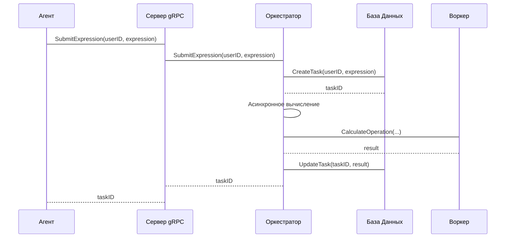

# Chapter 5: Оркестратор

После того, как мы изучили [gRPC Интерфейсы](04_grpc_интерфейсы.md), давайте разберемся с сердцем нашей системы, компонентом, который управляет всей вычислительной работой: **Оркестратором**.

Представьте себе, что вы - шеф-повар в большом ресторане. К вам поступают заказы (выражения для вычисления). Вы не можете приготовить все блюда (вычисления) в одиночку.  Вместо этого, вы - **Оркестратор**, который руководит командой поваров (Воркеров). Вы разбиваете сложные блюда на простые операции, назначаете эти операции отдельным поварам, а затем собираете результаты, чтобы подать клиенту готовое блюдо.

Центральный пример: Агент передает Оркестратору задачу на вычисление выражения `(2+2)*4 + 10/2`.  Оркестратор разбивает эту задачу на более мелкие операции: сложение, умножение, деление.  Он отправляет эти операции Воркерам для параллельного выполнения.  Когда Воркеры завершают операции, Оркестратор собирает результаты и вычисляет окончательный ответ. Без Оркестратора, Агент должен был бы сам разбивать задачу на операции и управлять Воркерами, что было бы сложно и неэффективно.

## Ключевые концепции Оркестратора

Оркестратор состоит из нескольких ключевых концепций:

1.  **Прием задач от Агента:** Оркестратор получает задачи на вычисление от Агента через gRPC интерфейс. Это как шеф-повар, получающий заказы от официанта.

2.  **Разбиение задачи на подзадачи:** Оркестратор разбивает сложные выражения на более простые операции. Это как шеф-повар, разбивающий сложное блюдо на отдельные этапы приготовления.  Например, выражение `(2+2)*4` будет разбито на операции: `2+2`, `4*4`.

3.  **Распределение подзадач между Воркерами:** Оркестратор назначает эти операции свободным Воркерам. Это как шеф-повар, распределяющий работу между поварами на кухне. Он старается загрузить всех поваров работой, чтобы блюдо приготовилось быстрее.

4.  **Сбор результатов от Воркеров:**  Оркестратор получает результаты вычислений от Воркеров.  Это как шеф-повар, собирающий готовые ингредиенты от поваров.

5.  **Формирование окончательного ответа:** Оркестратор объединяет результаты и формирует окончательный ответ. Это как шеф-повар, собирающий все ингредиенты вместе, чтобы подать клиенту готовое блюдо.

6.  **Управление состоянием задачи:**  Оркестратор отслеживает состояние каждой задачи: создана, в процессе выполнения, завершена, с ошибкой.  Это как шеф-повар, следящий за статусом каждого заказа.

7.  **Сохранение состояния задачи в базе данных:** Оркестратор сохраняет состояние задачи, результаты и ошибки в базе данных. Это необходимо для того, чтобы можно было отслеживать ход выполнения задач и получать результаты позже.

## Как использовать Оркестратор?

Давайте рассмотрим, как Агент может использовать Оркестратор для вычисления выражения.

**Задача:** Агент с ID `a1b2c3d4-e5f6-7890-1234-567890abcdef` хочет вычислить выражение `(2+2)*4`.

1.  **Отправка запроса:** Агент отправляет gRPC запрос `SubmitExpression` Оркестратору, передавая ID пользователя и выражение.

    ```go
    // Пример gRPC запроса от Агента к Оркестратору
    req := &pb.ExpressionRequest{
      UserId:     "a1b2c3d4-e5f6-7890-1234-567890abcdef",
      Expression: "(2+2)*4",
    }

    resp, err := orchestratorClient.SubmitExpression(context.Background(), req)
    if err != nil {
      // Обработка ошибки
    }

    taskID := resp.TaskId
    ```

2.  **Обработка запроса Оркестратором:** Оркестратор получает запрос, создает новую задачу в базе данных и запускает асинхронное вычисление.

3.  **Ответ Оркестратора:** Оркестратор возвращает ID задачи Агенту.

    ```go
    // Пример gRPC ответа от Оркестратора к Агенту
    {
      "task_id": "123e4567-e89b-12d3-a456-426614174000"
    }
    ```

Теперь Агент может использовать этот `task_id` для отслеживания прогресса вычисления, запросив детали задачи.

## Что происходит под капотом?

Давайте посмотрим, что происходит внутри Оркестратора, когда он получает запрос на вычисление.

1.  **Получение gRPC запроса:** Оркестратор получает gRPC запрос `SubmitExpression`.
2.  **Проверка входных данных:** Проверяется ID пользователя и выражение. Если входные данные невалидны, возвращается ошибка.
3.  **Создание задачи в базе данных:** Создается новая запись о задаче в базе данных со статусом "created".
4.  **Разбиение выражения на дерево (AST):** Выражение преобразуется в абстрактное синтаксическое дерево (Abstract Syntax Tree). Это как разбиение сложного предложения на составляющие его части: подлежащее, сказуемое и т.д.
5.  **Запуск асинхронного вычисления:** Запускается goroutine (легковесный поток), который выполняет рекурсивное вычисление AST.
6.  **Отправка ответа Агенту:** Оркестратор возвращает ID задачи Агенту.

Вот как это выглядит на диаграмме последовательности:



Теперь давайте посмотрим на код, чтобы увидеть, как это реализовано.

```go
// internal/orchestrator/grpc_handler/orchestrator_server.go
func (s *OrchestratorServer) SubmitExpression(ctx context.Context, req *pb.ExpressionRequest) (*pb.ExpressionResponse, error) {
  // ... проверка userID и expression ...

  taskID, err := s.taskRepo.CreateTask(ctx, userID, expression) // Создаем задачу в БД
  if err != nil {
    // ... обработка ошибки ...
  }

  go s.startEvaluation(taskID, userID, expression, astRootNode) // Запускаем асинхронное вычисление

  return &pb.ExpressionResponse{TaskId: taskID.String()}, nil // Возвращаем taskID
}
```

В этом коде мы видим, как обработчик `SubmitExpression` получает ID пользователя и выражение, создает задачу в базе данных и запускает асинхронное вычисление.

```go
// internal/orchestrator/grpc_handler/orchestrator_server.go
func (s *OrchestratorServer) startEvaluation(taskID uuid.UUID, userID uuid.UUID, originalExpr string, rootNode ast.Node) {
	// ... обертка для логирования ...

	result, evalErr := s.evaluator.Evaluate(evalCtx, rootNode) // Вычисляем выражение
	// ... обработка ошибок и запись результатов в БД ...
}
```

В этом коде мы видим, как запускается асинхронное вычисление выражения.  `s.evaluator.Evaluate` выполняет рекурсивное вычисление AST.

```go
// internal/orchestrator/service/evaluator.go
func (e *ExpressionEvaluator) Evaluate(ctx context.Context, node ast.Node) (float64, error) {
  // ... разбор типов нод AST ...

  case *ast.BinaryNode: // Бинарная операция (+, -, *, /)
    // ... вычисление левого и правого операнда ...
    result, workerErr := e.callWorker(ctx, opSymbol, leftVal, rightVal) // Отправляем операцию Воркеру
    return result, workerErr

  // ... другие типы нод ...
}
```

Здесь видно, как происходит рекурсивный обход дерева AST.  Для бинарных операций, таких как `+`, `-`, `*`, `/`,  вызывается функция `e.callWorker`, которая отправляет операцию Воркеру. Метод `callWorker` отправляет gRPC запрос Воркеру, используя [gRPC Интерфейсы](04_grpc_интерфейсы.md).

## Заключение

В этой главе мы узнали, что такое **Оркестратор** и как он работает. Мы рассмотрели, как Оркестратор принимает задачи от Агента, разбивает их на подзадачи, распределяет их между Воркерами и собирает результаты. Теперь вы знаете, как Оркестратор координирует вычисления в нашей системе.

В следующей главе мы поговорим о [Воркере](06_воркер.md), который выполняет фактические вычисления.


---

Generated by [AI Codebase Knowledge Builder](https://github.com/The-Pocket/Tutorial-Codebase-Knowledge)