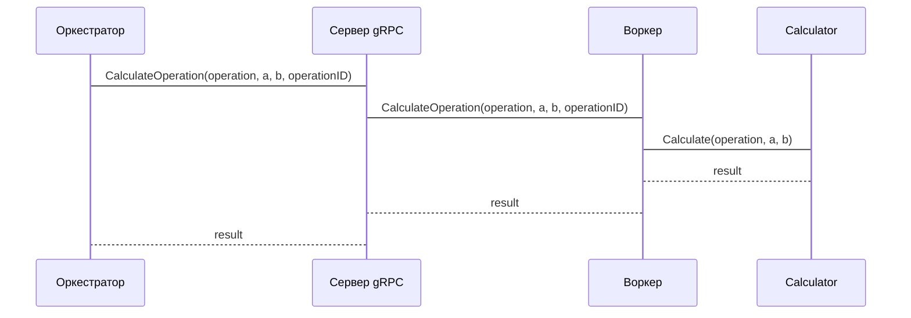

# Chapter 6: Воркер

После того, как мы подробно рассмотрели [Оркестратор](05_оркестратор.md), который управляет задачами, пришло время познакомиться с "рабочей лошадкой" нашей системы – **Воркером**.

Представьте себе пиццерию. Оркестратор (шеф-повар) принимает заказы (задачи) и распределяет работу между поварами. **Воркер** – это повар, который получает простую задачу (например, нарезать колбасу или натереть сыр) и выполняет ее. Он не знает, для какой пиццы нужны эти ингредиенты, он просто делает свою часть работы.

Центральный пример: Оркестратор получил задачу вычислить `2 + 3`. Он отправляет эту задачу Воркеру. Воркер складывает числа и возвращает результат (5) Оркестратору. Воркер не знает, является ли эта операция частью более сложного вычисления. Он просто выполняет сложение. Без Воркера, Оркестратору пришлось бы выполнять все вычисления самому, что было бы очень медленно.

## Ключевые концепции Воркера

Воркер состоит из нескольких ключевых концепций:

1.  **Прием задач от Оркестратора:** Воркер получает простые математические операции от Оркестратора через gRPC интерфейс. Это как повар, получающий задание от шеф-повара.
2.  **Выполнение операции:** Воркер выполняет полученную математическую операцию (сложение, вычитание, умножение, деление и т.д.). Это как повар, нарезающий колбасу или натирающий сыр.
3.  **Возврат результата Оркестратору:** Воркер возвращает результат вычисления Оркестратору. Это как повар, отдающий нарезанную колбасу или натертый сыр шеф-повару.

## Как использовать Воркера?

Давайте посмотрим, как Оркестратор использует Воркера для вычисления `2 * 3`.

**Задача:** Оркестратор хочет вычислить `2 * 3`.

1.  **Отправка запроса:** Оркестратор отправляет gRPC запрос `CalculateOperation` Воркеру, передавая операцию (`*`) и операнды (2 и 3).

    ```go
    // Пример gRPC запроса от Оркестратора к Воркеру
    req := &pb.CalculateOperationRequest{ // pb - это сокращение от proto/gen/worker
        OperationSymbol: "*",
        OperandA:        2,
        OperandB:        3,
        OperationId:    "some-unique-id",
    }

    resp, err := workerClient.CalculateOperation(context.Background(), req)
    if err != nil {
        // Обработка ошибки
    }

    result := resp.Result
    ```

2.  **Обработка запроса Воркером:** Воркер получает запрос, выполняет умножение и формирует результат.

3.  **Ответ Воркера:** Воркер возвращает результат (6) Оркестратору.

    ```go
    // Пример gRPC ответа от Воркера к Оркестратору
    {
        "operation_id": "some-unique-id",
        "result": 6
    }
    ```

## Что происходит под капотом?

Давайте посмотрим, что происходит внутри Воркера, когда он получает запрос на вычисление.

1.  **Получение gRPC запроса:** Воркер получает gRPC запрос `CalculateOperation`.
2.  **Выполнение операции:**  Функция `Calculate` в `internal/worker/service/calculator.go` выполняет математическую операцию, указанную в запросе. Для каждой операции имитируется задержка (чтобы показать, что реальные вычисления могут занимать время).
3.  **Отправка ответа Оркестратору:** Воркер возвращает результат вычисления Оркестратору.

Вот как это выглядит на диаграмме последовательности:



Теперь давайте посмотрим на код, чтобы увидеть, как это реализовано.

```go
// internal/worker/grpc_handler/worker_server.go
func (s *WorkerServer) CalculateOperation(ctx context.Context, req *pb.CalculateOperationRequest) (*pb.CalculateOperationResponse, error) {
	// ... логирование запроса ...

	result, serviceErr := s.calcService.Calculate(ctx, req.GetOperationSymbol(), req.GetOperandA(), req.GetOperandB())

	// ... обработка ошибок и формирование ответа ...

	return &pb.CalculateOperationResponse{OperationId: req.GetOperationId(), Result: result}, nil
}
```

В этом коде мы видим, как обработчик `CalculateOperation` получает операцию и операнды, вызывает `s.calcService.Calculate` для выполнения вычисления и возвращает результат.

```go
// internal/worker/service/calculator.go
func (s *calculatorService) Calculate(ctx context.Context, operation string, a, b float64) (float64, error) {
	// ... логирование ...

	var result float64

	switch operation {
	case "+":
		result = a + b
		// ...
	case "*":
		result = a * b
		// ...
	// ... другие операции ...
	}

	time.Sleep(s.cfg.Multiplication) // Имитация задержки

	return result, nil
}
```

Здесь мы видим, как функция `Calculate` выполняет фактическое вычисление в зависимости от операции. Также имитируется задержка с помощью `time.Sleep` для имитации реальной нагрузки.

## Заключение

В этой главе мы узнали, что такое **Воркер** и как он работает. Мы рассмотрели, как Воркер получает задачи от Оркестратора, выполняет вычисления и возвращает результаты. Теперь вы знаете, как Воркер выполняет фактическую работу в нашей системе распределенных вычислений.

В следующей главе мы поговорим о [Репозитории](07_репозиторий.md), который используется для хранения данных о задачах и результатах вычислений.