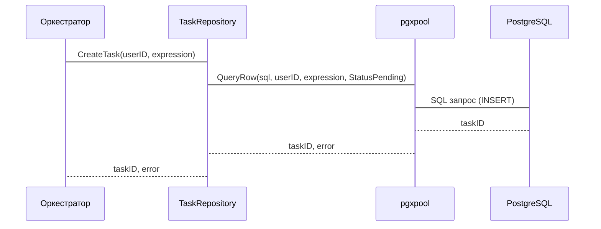

# Chapter 7: Репозиторий

После изучения [Воркера](06_воркер.md), который выполняет вычисления, давайте поговорим о том, как мы храним данные о вычислениях и пользователях в нашей системе. Для этого мы используем **Репозиторий**.

Представьте, что вы работаете в библиотеке. Вам нужно найти книгу (данные) по названию, добавить новую книгу или обновить информацию о существующей книге. **Репозиторий** - это как библиотекарь, работающий с базой данных. Он знает, как найти, добавить, изменить и удалить данные в базе данных.

Центральный пример: Когда пользователь регистрируется в нашем приложении, нам нужно сохранить информацию о нем (логин, пароль) в базе данных. Когда пользователь запрашивает историю своих вычислений, нам нужно получить эти данные из базы данных. **Репозиторий** предоставляет нам удобные методы для выполнения этих операций, скрывая сложность работы с базой данных.

## Ключевые концепции Репозитория

Репозиторий состоит из нескольких ключевых концепций:

1.  **Интерфейс Репозитория:** Это как меню для библиотекаря. Он определяет, какие действия можно выполнять с данными. Например, `CreateUser` (создать пользователя), `GetUserByLogin` (получить пользователя по логину), `CreateTask` (создать задачу), `GetTaskByID` (получить задачу по ID).
2.  **Реализация Репозитория:** Это как сам библиотекарь, который знает, как выполнять действия, определенные в интерфейсе. Например, `pgxUserRepository` - это реализация репозитория, которая использует библиотеку `pgx` для работы с базой данных PostgreSQL.
3.  **Модель Данных:** Это как книги в библиотеке. Модель данных определяет структуру данных, которые хранятся в базе данных. Например, структура `User` содержит поля `ID`, `Login`, `PasswordHash`, `CreatedAt`.
4.  **База Данных:** Это как полки в библиотеке, где хранятся данные. Мы используем базу данных PostgreSQL для хранения данных о пользователях и задачах.

## Как использовать Репозиторий?

Давайте рассмотрим, как Оркестратор может использовать репозиторий для создания новой задачи.

**Задача:** Оркестратор хочет создать новую задачу для пользователя с ID `a1b2c3d4-e5f6-7890-1234-567890abcdef` и выражением `(2+2)*4`.

1.  **Получение экземпляра репозитория:** Сначала нам нужно получить экземпляр репозитория `TaskRepository`.

    ```go
    taskRepo := repository.NewPgxTaskRepository(dbPool, log)
    ```

    Здесь `dbPool` - это пул соединений с базой данных PostgreSQL, а `log` - это логгер. `NewPgxTaskRepository` создает новую реализацию репозитория, используя пул соединений и логгер.

2.  **Создание задачи:** Затем мы вызываем метод `CreateTask` для создания новой задачи.

    ```go
    taskID, err := taskRepo.CreateTask(ctx, userID, expression)
    if err != nil {
        // Обработка ошибки
    }
    ```

    Здесь `ctx` - это контекст запроса, `userID` - ID пользователя, а `expression` - выражение для вычисления. `CreateTask` создает новую задачу в базе данных и возвращает ID созданной задачи.

## Что происходит под капотом?

Давайте посмотрим, что происходит, когда мы вызываем `taskRepo.CreateTask`.

1.  **Формирование SQL запроса:** Репозиторий формирует SQL запрос для вставки новой записи в таблицу `tasks`.
2.  **Выполнение SQL запроса:** Репозиторий выполняет SQL запрос с помощью пула соединений `pgxpool`.
3.  **Обработка результата:** Репозиторий обрабатывает результат выполнения SQL запроса. Если запрос выполнен успешно, репозиторий возвращает ID созданной задачи. Если произошла ошибка, репозиторий возвращает ошибку.

Вот как это выглядит на диаграмме последовательности:



Теперь давайте посмотрим на код, чтобы увидеть, как это реализовано.

```go
// internal/orchestrator/repository/task_postgres.go
func (r *pgxTaskRepository) CreateTask(ctx context.Context, userID uuid.UUID, expression string) (uuid.UUID, error) {
	query := `
        INSERT INTO tasks (user_id, expression, status)
        VALUES ($1, $2, $3)
        RETURNING id
    `
	var taskID uuid.UUID
	err := r.db.QueryRow(ctx, query, userID, expression, StatusPending).Scan(&taskID)
	if err != nil {
        // Обработка ошибки
	}
	return taskID, nil
}
```

В этом коде мы видим, как формируется SQL запрос `INSERT` для вставки новой записи в таблицу `tasks`.  `r.db.QueryRow` выполняет SQL запрос и возвращает результат. `Scan(&taskID)` получает ID созданной задачи из результата запроса.  `StatusPending` -- это константа, определенная в том же файле, указывающая на начальный статус задачи.

Кроме репозитория задач, у нас также есть репозиторий пользователей (`internal/agent/repository/user_postgres.go`), который используется для управления информацией о пользователях.  Он предоставляет методы для создания пользователей, получения пользователей по логину и т.д.

```go
// internal/agent/repository/user_postgres.go
func (r *pgxUserRepository) CreateUser(ctx context.Context, login, passwordHash string) (uuid.UUID, error) {
	query := `INSERT INTO users (login, password_hash) VALUES ($1, $2) RETURNING id`
	var userID uuid.UUID

	err := r.pool.QueryRow(ctx, query, login, passwordHash).Scan(&userID)
	if err != nil {
        // Обработка ошибки
	}

	return userID, nil
}
```
В этом коде мы видим, как формируется SQL запрос `INSERT` для вставки новой записи в таблицу `users`.  `r.pool.QueryRow` выполняет SQL запрос и возвращает результат. `Scan(&userID)` получает ID созданного пользователя из результата запроса.

Интерфейс `DBPoolIface` (`internal/orchestrator/repository/db_iface.go`) определен для облегчения тестирования. Он позволяет использовать моки базы данных вместо реальной базы данных во время тестирования.

## Заключение

В этой главе мы узнали, что такое **Репозиторий** и как он работает. Мы рассмотрели, как репозиторий предоставляет методы для сохранения, извлечения и обновления данных в базе данных. Теперь вы знаете, как использовать репозиторий для работы с данными в нашем приложении.

В следующей главе мы поговорим о [Логгере (Logger)](08_логгер__logger_.md), который используется для записи информации о работе нашего приложения.