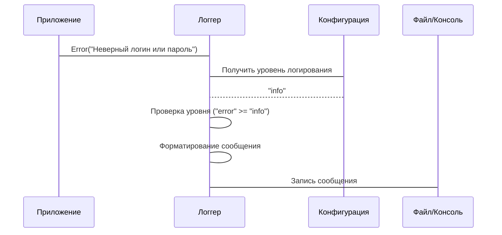

# Chapter 8: Логгер (Logger)

После изучения [Репозитория](07_репозиторий.md), который хранит наши данные, давайте поговорим о том, как мы отслеживаем, что происходит в нашем приложении. Для этого мы используем **Логгер (Logger)**.

Представьте, что вы - пилот самолета. Во время полета вы ведете бортовой журнал, записывая все важные события: взлет, посадка, турбулентность, проблемы с двигателем. **Логгер** - это как бортовой журнал для нашего приложения. Он записывает все важные события, происходящие в приложении: ошибки, предупреждения, информационные сообщения. Это помогает нам отлаживать, мониторить и анализировать работу приложения.

Центральный пример: Представьте, что в нашем приложении возникла ошибка. Пользователь не может залогиниться. Без логгера, нам было бы очень сложно понять, что произошло. Но если мы используем логгер, то можем посмотреть в лог-файл и увидеть сообщение об ошибке, например: "Неверный логин или пароль". Это поможет нам быстро найти и исправить проблему.

## Ключевые концепции Логгера

Логгер состоит из нескольких ключевых концепций:

1.  **Уровни логирования (Log levels):** Это как важность сообщения в бортовом журнале. У нас есть разные уровни логирования:
    *   `Debug`: Самый низкий уровень, используется для отладочной информации.
    *   `Info`: Информационные сообщения о нормальной работе приложения.
    *   `Warn`: Предупреждения о потенциальных проблемах.
    *   `Error`: Сообщения об ошибках, которые не приводят к остановке приложения.
    *   `Fatal`: Критические ошибки, которые приводят к остановке приложения.
2.  **Формат логирования (Log format):** Это как формат записи в бортовом журнале. Мы можем настроить формат логирования, чтобы сообщения были легко читаемыми и содержали всю необходимую информацию: время, уровень логирования, сообщение, местоположение в коде.
3.  **Место назначения (Destination):** Это куда мы записываем наши логи. Обычно это файл, но мы можем также отправлять логи в консоль, в систему мониторинга или в облачное хранилище.

## Как использовать Логгер?

Давайте рассмотрим, как мы можем использовать логгер для записи информации об ошибке.

**Задача:** Мы хотим записать сообщение об ошибке, когда пользователь пытается залогиниться с неверным паролем.

1.  **Получение экземпляра логгера:** Сначала нам нужно получить экземпляр логгера. Мы настраиваем логгер в функции `New` в файле `internal/pkg/logger/logger.go`. Этот логгер используется во всех компонентах нашего приложения.

    ```go
    package main

    import (
    	"log"

    	"YaLyceum-GoProject-Final/internal/pkg/logger"
    )

    func main() {
    	logger, err := logger.New("info", "development")
    	if err != nil {
    		log.Fatalf("Ошибка инициализации логгера: %v", err)
    		return
    	}
    	defer logger.Sync() // Flush buffered log entries
    }
    ```

    Здесь мы указываем уровень логирования "info" и окружение "development".  В зависимости от окружения, логгер будет использовать разные настройки (например, формат логирования).
    `defer logger.Sync()` гарантирует, что все буферизованные записи лога будут сброшены на диск перед завершением программы.

2.  **Запись сообщения об ошибке:** Затем мы используем метод `Error` логгера для записи сообщения об ошибке.

    ```go
    package main

    import (
    	"log"

    	"YaLyceum-GoProject-Final/internal/pkg/logger"
    )

    func main() {
    	logger, err := logger.New("info", "development")
    	if err != nil {
    		log.Fatalf("Ошибка инициализации логгера: %v", err)
    		return
    	}
    	defer logger.Sync() // Flush buffered log entries

    	logger.Error("Неверный логин или пароль")
    }
    ```

    В этом примере мы записываем сообщение об ошибке "Неверный логин или пароль".  Если уровень логирования установлен на "info" или выше, это сообщение будет записано в лог-файл или консоль.

## Что происходит под капотом?

Давайте посмотрим, что происходит, когда мы вызываем `logger.Error`.

1.  **Проверка уровня логирования:** Логгер проверяет, соответствует ли уровень логирования сообщения уровню, установленному в конфигурации. Если уровень сообщения ниже установленного уровня, сообщение игнорируется.
2.  **Форматирование сообщения:** Логгер форматирует сообщение в соответствии с установленным форматом логирования. Добавляется время, уровень логирования, сообщение и другая информация.
3.  **Запись сообщения:** Логгер записывает отформатированное сообщение в место назначения (файл, консоль и т.д.).

Вот как это выглядит на диаграмме последовательности:



Теперь давайте посмотрим на код, чтобы увидеть, как это реализовано.

```go
// internal/pkg/logger/logger.go
func New(level string, appEnv string) (*zap.Logger, error) {
	logLevel, err := zapcore.ParseLevel(strings.ToLower(level))
	if err != nil {
		return nil, fmt.Errorf("неверный уровень логирования '%s': %w", level, err)
	}

	var config zap.Config
	if appEnv == "production" {
		config = zap.NewProductionConfig()
		config.EncoderConfig.TimeKey = "timestamp"
		config.EncoderConfig.EncodeTime = zapcore.RFC3339NanoTimeEncoder
	} else {
		config = zap.NewDevelopmentConfig()
		config.EncoderConfig.EncodeLevel = zapcore.CapitalColorLevelEncoder
		config.EncoderConfig.EncodeTime = zapcore.ISO8601TimeEncoder
	}

	config.Level = zap.NewAtomicLevelAt(logLevel)

	logger, err := config.Build()
	if err != nil {
		fmt.Fprintf(os.Stderr, "Ошибка инициализации логгера: %v\n", err)
		return zap.NewNop(), err
	}

	logger = logger.With(zap.String("service", "agent"))

	return logger, nil
}
```

В этом коде мы видим, как создается логгер с использованием библиотеки `zap`. Мы определяем уровень логирования и формат логирования в зависимости от окружения. Функция `zap.NewProductionConfig` и `zap.NewDevelopmentConfig` предоставляют стандартные конфигурации для production и development окружений соответственно.

Также, важно, чтобы [Конфигурация (Config)](01_конфигурация__config_.md) позволяла задавать уровень логирования, например, через переменные окружения. Это позволяет нам менять уровень логирования без изменения кода. Например, в `internal/agent/config/config.go`, мы можем добавить структуру `LoggerConfig` и использовать `mapstructure`, чтобы связать ее с переменными окружениями. Это позволит нам изменять уровень логирования, указывая значение в `.env` файле или через переменные окружения.

## Заключение

В этой главе мы узнали, что такое **Логгер (Logger)** и как он работает. Мы рассмотрели, как использовать логгер для записи сообщений об ошибках и других важных событиях в нашем приложении. Теперь вы знаете, как использовать логгер для отладки, мониторинга и анализа работы вашего приложения.

В следующей главе мы поговорим о [Makefile](09_makefile.md), который используется для автоматизации сборки и запуска нашего приложения.