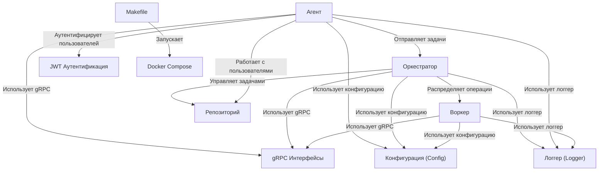

# Tutorial: YaLyceum-GoProject-Final

Этот проект - **распределенный калькулятор выражений**. *Агент* принимает запросы от пользователей, *Оркестратор* разделяет их на части и отправляет *Воркерам* для вычисления, а затем собирает результат. *Репозиторий* хранит данные о пользователях и задачах.

**Source Repository:** [https://github.com/Qu1nel/YaLyceum-GoProject-Final](https://github.com/Qu1nel/YaLyceum-GoProject-Final)

## Chapters

1. [Конфигурация (Config)](01_конфигурация__config_.md)
2. [JWT Аутентификация](02_jwt_аутентификация.md)
3. [Агент](03_агент.md)
4. [gRPC Интерфейсы](04_grpc_интерфейсы.md)
5. [Оркестратор](05_оркестратор.md)
6. [Воркер](06_воркер.md)
7. [Репозиторий](07_репозиторий.md)
8. [Логгер (Logger)](08_логгер__logger_.md)
9. [Makefile](09_makefile.md)
10. [Docker Compose](10_docker_compose.md)

---

Generated by [AI Codebase Knowledge Builder](https://github.com/The-Pocket/Tutorial-Codebase-Knowledge)